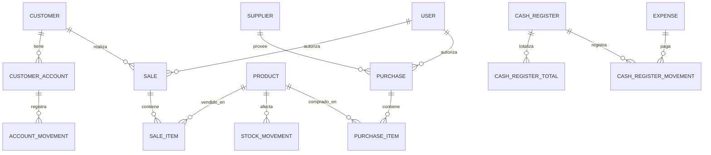

# Diagrama Entidad-Relación (ER)

Este documento describe las principales entidades y relaciones del sistema de gestión. El diagrama está representado en formato texto para facilitar la visualización rápida.

## Entidades principales

## Descripción de entidades

- **CUSTOMER**: Clientes del sistema.
- **CUSTOMER_ACCOUNT**: Cuentas corrientes de clientes.
- **ACCOUNT_MOVEMENT**: Movimientos en cuentas corrientes.
- **SALE**: Ventas realizadas.
- **SALE_ITEM**: Ítems de cada venta.
- **PRODUCT**: Productos gestionados.
- **STOCK_MOVEMENT**: Movimientos de stock.
- **SUPPLIER**: Proveedores.
- **PURCHASE**: Compras realizadas.
- **PURCHASE_ITEM**: Ítems de cada compra.
- **CASH_REGISTER**: Cajas registradoras.
- **CASH_REGISTER_TOTAL**: Totales de caja.
- **CASH_REGISTER_MOVEMENT**: Movimientos de caja.
- **EXPENSE**: Gastos registrados.
- **USER**: Usuarios del sistema.

## Notas
- Las relaciones reflejan las migraciones y módulos presentes en el backend.
- Puedes visualizar este diagrama usando [Mermaid Live Editor](https://mermaid.live/).
