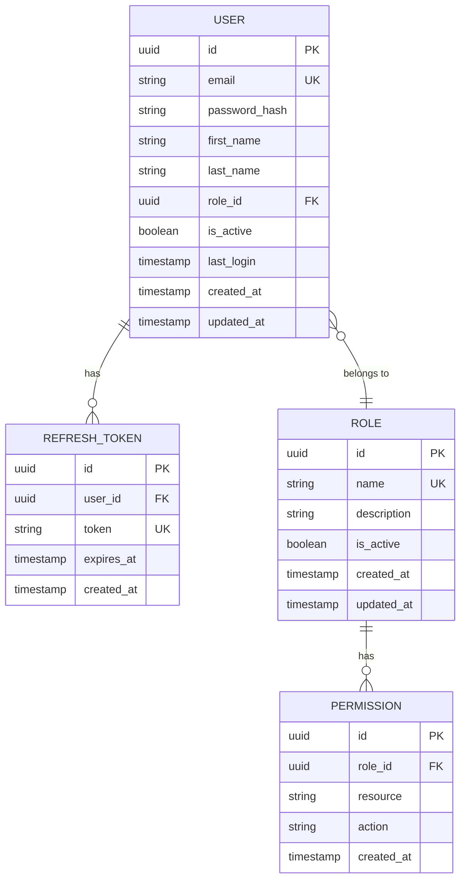

# Módulo: Autenticación (Auth)

## 1. Descripción y Objetivo

### 1.1 Descripción
El módulo de Autenticación gestiona el acceso al sistema, la identidad de los usuarios y los permisos. Proporciona un sistema seguro de login/logout basado en JWT con tokens de acceso y refresh.

### 1.2 Objetivo
- Controlar el acceso al sistema mediante autenticación
- Gestionar usuarios del sistema
- Implementar sistema de roles y permisos
- Proteger endpoints mediante guards
- Mantener sesiones seguras con JWT
- Proporcionar funcionalidad de recuperación de contraseña

### 1.3 Funcionalidades Principales
- Login con email y contraseña
- Logout y revocación de tokens
- Refresh de access tokens
- Gestión CRUD de usuarios
- Asignación de roles
- Cambio de contraseña
- Recuperación de contraseña (email)
- Perfil de usuario

---

## 2. Modelo de Datos

### 2.1 Diagrama ER



### 2.2 Entidades

#### 2.2.1 User (Usuario)

**Tabla**: `users`

| Campo | Tipo | Constraints | Descripción |
|-------|------|-------------|-------------|
| id | UUID | PK, Default: uuid_generate_v4() | Identificador único |
| email | VARCHAR(255) | NOT NULL, UNIQUE | Email del usuario |
| password_hash | VARCHAR(255) | NOT NULL | Contraseña hasheada (bcrypt) |
| first_name | VARCHAR(100) | NOT NULL | Nombre |
| last_name | VARCHAR(100) | NOT NULL | Apellido |
| role_id | UUID | FK → roles(id), NOT NULL | Rol del usuario |
| is_active | BOOLEAN | NOT NULL, Default: true | Estado del usuario |
| last_login | TIMESTAMP | NULL | Último login exitoso |
| created_at | TIMESTAMP | NOT NULL, Default: CURRENT_TIMESTAMP | Fecha de creación |
| updated_at | TIMESTAMP | NOT NULL, Default: CURRENT_TIMESTAMP | Fecha de actualización |

**Índices:**
```sql
CREATE UNIQUE INDEX idx_users_email ON users(email);
CREATE INDEX idx_users_role ON users(role_id);
CREATE INDEX idx_users_active ON users(is_active);
```

#### 2.2.2 Role (Rol)

**Tabla**: `roles`

| Campo | Tipo | Constraints | Descripción |
|-------|------|-------------|-------------|
| id | UUID | PK, Default: uuid_generate_v4() | Identificador único |
| name | VARCHAR(50) | NOT NULL, UNIQUE | Nombre del rol |
| description | TEXT | NULL | Descripción del rol |
| is_active | BOOLEAN | NOT NULL, Default: true | Estado del rol |
| created_at | TIMESTAMP | NOT NULL, Default: CURRENT_TIMESTAMP | Fecha de creación |
| updated_at | TIMESTAMP | NOT NULL, Default: CURRENT_TIMESTAMP | Fecha de actualización |

**Índices:**
```sql
CREATE UNIQUE INDEX idx_roles_name ON roles(name);
```

**Roles predefinidos**:
- `admin`: Acceso total al sistema
- `manager`: Gestión de productos, ventas, reportes
- `cashier`: Solo punto de venta y caja
- `viewer`: Solo lectura

#### 2.2.3 Permission (Permiso)

**Tabla**: `permissions`

| Campo | Tipo | Constraints | Descripción |
|-------|------|-------------|-------------|
| id | UUID | PK, Default: uuid_generate_v4() | Identificador único |
| role_id | UUID | FK → roles(id), NOT NULL | Rol al que pertenece |
| resource | VARCHAR(50) | NOT NULL | Recurso (products, sales, etc.) |
| action | VARCHAR(50) | NOT NULL | Acción (create, read, update, delete) |
| created_at | TIMESTAMP | NOT NULL, Default: CURRENT_TIMESTAMP | Fecha de creación |

**Índices:**
```sql
CREATE INDEX idx_permissions_role ON permissions(role_id);
CREATE INDEX idx_permissions_resource_action ON permissions(resource, action);
CREATE UNIQUE INDEX idx_permissions_unique ON permissions(role_id, resource, action);
```

**Acciones estándar**:
- `create`: Crear nuevos registros
- `read`: Leer/consultar registros
- `update`: Actualizar registros
- `delete`: Eliminar registros
- `manage`: Todas las acciones anteriores

#### 2.2.4 RefreshToken (Token de Refresco)

**Tabla**: `refresh_tokens`

| Campo | Tipo | Constraints | Descripción |
|-------|------|-------------|-------------|
| id | UUID | PK, Default: uuid_generate_v4() | Identificador único |
| user_id | UUID | FK → users(id), NOT NULL | Usuario propietario |
| token | VARCHAR(500) | NOT NULL, UNIQUE | Token de refresh |
| expires_at | TIMESTAMP | NOT NULL | Fecha de expiración |
| created_at | TIMESTAMP | NOT NULL, Default: CURRENT_TIMESTAMP | Fecha de creación |

**Índices:**
```sql
CREATE UNIQUE INDEX idx_refresh_tokens_token ON refresh_tokens(token);
CREATE INDEX idx_refresh_tokens_user ON refresh_tokens(user_id);
CREATE INDEX idx_refresh_tokens_expires ON refresh_tokens(expires_at);
```

---

## 3. Backend (NestJS)

### 3.1 Estructura de Carpetas

```
src/modules/auth/
├── entities/
│   ├── user.entity.ts
│   ├── role.entity.ts
│   ├── permission.entity.ts
│   └── refresh-token.entity.ts
├── dto/
│   ├── login.dto.ts
│   ├── register.dto.ts
│   ├── refresh-token.dto.ts
│   ├── change-password.dto.ts
│   ├── forgot-password.dto.ts
│   ├── reset-password.dto.ts
│   ├── create-user.dto.ts
│   ├── update-user.dto.ts
│   └── update-profile.dto.ts
├── strategies/
│   ├── jwt.strategy.ts
│   ├── jwt-refresh.strategy.ts
│   └── local.strategy.ts
├── guards/
│   ├── jwt-auth.guard.ts
│   ├── jwt-refresh.guard.ts
│   ├── roles.guard.ts
│   └── permissions.guard.ts
├── decorators/
│   ├── current-user.decorator.ts
│   ├── roles.decorator.ts
│   └── permissions.decorator.ts
├── auth.controller.ts
├── users.controller.ts
├── auth.service.ts
├── users.service.ts
├── tokens.service.ts
├── auth.repository.ts
└── auth.module.ts
```

### 3.2 Entities (TypeORM)

#### 3.2.1 User Entity

```typescript
// entities/user.entity.ts
import {
  Entity,
  PrimaryGeneratedColumn,
  Column,
  CreateDateColumn,
  UpdateDateColumn,
  ManyToOne,
  OneToMany,
  JoinColumn,
  Index,
  BeforeInsert,
  BeforeUpdate,
} from 'typeorm';
import * as bcrypt from 'bcrypt';
import { Role } from './role.entity';
import { RefreshToken } from './refresh-token.entity';

@Entity('users')
@Index(['email'])
export class User {
  @PrimaryGeneratedColumn('uuid')
  id: string;

  @Column({ type: 'varchar', length: 255, unique: true })
  email: string;

  @Column({ type: 'varchar', length: 255, select: false })
  passwordHash: string;

  @Column({ type: 'varchar', length: 100 })
  firstName: string;

  @Column({ type: 'varchar', length: 100 })
  lastName: string;

  @Column({ type: 'uuid' })
  roleId: string;

  @ManyToOne(() => Role, { eager: true })
  @JoinColumn({ name: 'role_id' })
  role: Role;

  @Column({ type: 'boolean', default: true })
  isActive: boolean;

  @Column({ type: 'timestamp', nullable: true })
  lastLogin: Date;

  @OneToMany(() => RefreshToken, (token) => token.user)
  refreshTokens: RefreshToken[];

  @CreateDateColumn({ type: 'timestamp' })
  createdAt: Date;

  @UpdateDateColumn({ type: 'timestamp' })
  updatedAt: Date;

  // Virtual field
  get fullName(): string {
    return `${this.firstName} ${this.lastName}`;
  }

  // Method to validate password
  async validatePassword(password: string): Promise<boolean> {
    return bcrypt.compare(password, this.passwordHash);
  }

  // Hash password before insert/update
  @BeforeInsert()
  @BeforeUpdate()
  async hashPassword() {
    if (this.passwordHash && !this.passwordHash.startsWith('$2b$')) {
      this.passwordHash = await bcrypt.hash(this.passwordHash, 10);
    }
  }
}
```

#### 3.2.2 Role Entity

```typescript
// entities/role.entity.ts
import {
  Entity,
  PrimaryGeneratedColumn,
  Column,
  CreateDateColumn,
  UpdateDateColumn,
  OneToMany,
  Index,
} from 'typeorm';
import { User } from './user.entity';
import { Permission } from './permission.entity';

@Entity('roles')
@Index(['name'])
export class Role {
  @PrimaryGeneratedColumn('uuid')
  id: string;

  @Column({ type: 'varchar', length: 50, unique: true })
  name: string;

  @Column({ type: 'text', nullable: true })
  description: string;

  @Column({ type: 'boolean', default: true })
  isActive: boolean;

  @OneToMany(() => User, (user) => user.role)
  users: User[];

  @OneToMany(() => Permission, (permission) => permission.role, { eager: true })
  permissions: Permission[];

  @CreateDateColumn({ type: 'timestamp' })
  createdAt: Date;

  @UpdateDateColumn({ type: 'timestamp' })
  updatedAt: Date;
}
```

#### 3.2.3 Permission Entity

```typescript
// entities/permission.entity.ts
import {
  Entity,
  PrimaryGeneratedColumn,
  Column,
  CreateDateColumn,
  ManyToOne,
  JoinColumn,
  Index,
} from 'typeorm';
import { Role } from './role.entity';

@Entity('permissions')
@Index(['roleId', 'resource', 'action'], { unique: true })
export class Permission {
  @PrimaryGeneratedColumn('uuid')
  id: string;

  @Column({ type: 'uuid' })
  roleId: string;

  @ManyToOne(() => Role, (role) => role.permissions, { onDelete: 'CASCADE' })
  @JoinColumn({ name: 'role_id' })
  role: Role;

  @Column({ type: 'varchar', length: 50 })
  resource: string;

  @Column({ type: 'varchar', length: 50 })
  action: string;

  @CreateDateColumn({ type: 'timestamp' })
  createdAt: Date;
}
```

#### 3.2.4 RefreshToken Entity

```typescript
// entities/refresh-token.entity.ts
import {
  Entity,
  PrimaryGeneratedColumn,
  Column,
  CreateDateColumn,
  ManyToOne,
  JoinColumn,
  Index,
} from 'typeorm';
import { User } from './user.entity';

@Entity('refresh_tokens')
@Index(['token'])
@Index(['expiresAt'])
export class RefreshToken {
  @PrimaryGeneratedColumn('uuid')
  id: string;

  @Column({ type: 'uuid' })
  userId: string;

  @ManyToOne(() => User, (user) => user.refreshTokens, { onDelete: 'CASCADE' })
  @JoinColumn({ name: 'user_id' })
  user: User;

  @Column({ type: 'varchar', length: 500, unique: true })
  token: string;

  @Column({ type: 'timestamp' })
  expiresAt: Date;

  @CreateDateColumn({ type: 'timestamp' })
  createdAt: Date;

  isExpired(): boolean {
    return new Date() > this.expiresAt;
  }
}
```

### 3.3 DTOs

#### 3.3.1 Auth DTOs

```typescript
// dto/login.dto.ts
import { z } from 'zod';
import { ApiProperty } from '@nestjs/swagger';

export const LoginSchema = z.object({
  email: z.string().email('Email inválido'),
  password: z.string().min(1, 'La contraseña es requerida'),
});

export type LoginDTO = z.infer<typeof LoginSchema>;

export class LoginDto implements LoginDTO {
  @ApiProperty({ example: 'user@example.com' })
  email: string;

  @ApiProperty({ example: 'password123' })
  password: string;
}

export class LoginResponseDto {
  @ApiProperty()
  accessToken: string;

  @ApiProperty()
  refreshToken: string;

  @ApiProperty()
  user: {
    id: string;
    email: string;
    firstName: string;
    lastName: string;
    role: string;
  };
}
```

```typescript
// dto/register.dto.ts
import { z } from 'zod';
import { ApiProperty } from '@nestjs/swagger';

export const RegisterSchema = z.object({
  email: z.string().email('Email inválido'),
  password: z
    .string()
    .min(8, 'La contraseña debe tener al menos 8 caracteres')
    .regex(/[A-Z]/, 'Debe contener al menos una mayúscula')
    .regex(/[a-z]/, 'Debe contener al menos una minúscula')
    .regex(/[0-9]/, 'Debe contener al menos un número'),
  firstName: z.string().min(1, 'El nombre es requerido').max(100),
  lastName: z.string().min(1, 'El apellido es requerido').max(100),
  roleId: z.string().uuid().optional(),
});

export type RegisterDTO = z.infer<typeof RegisterSchema>;

export class RegisterDto implements RegisterDTO {
  @ApiProperty({ example: 'user@example.com' })
  email: string;

  @ApiProperty({ example: 'Password123' })
  password: string;

  @ApiProperty({ example: 'Juan' })
  firstName: string;

  @ApiProperty({ example: 'Pérez' })
  lastName: string;

  @ApiProperty({ format: 'uuid', required: false })
  roleId?: string;
}
```

```typescript
// dto/refresh-token.dto.ts
import { z } from 'zod';
import { ApiProperty } from '@nestjs/swagger';

export const RefreshTokenSchema = z.object({
  refreshToken: z.string().min(1, 'El refresh token es requerido'),
});

export type RefreshTokenDTO = z.infer<typeof RefreshTokenSchema>;

export class RefreshTokenDto implements RefreshTokenDTO {
  @ApiProperty()
  refreshToken: string;
}
```

```typescript
// dto/change-password.dto.ts
import { z } from 'zod';
import { ApiProperty } from '@nestjs/swagger';

export const ChangePasswordSchema = z.object({
  currentPassword: z.string().min(1, 'La contraseña actual es requerida'),
  newPassword: z
    .string()
    .min(8, 'La contraseña debe tener al menos 8 caracteres')
    .regex(/[A-Z]/, 'Debe contener al menos una mayúscula')
    .regex(/[a-z]/, 'Debe contener al menos una minúscula')
    .regex(/[0-9]/, 'Debe contener al menos un número'),
});

export type ChangePasswordDTO = z.infer<typeof ChangePasswordSchema>;

export class ChangePasswordDto implements ChangePasswordDTO {
  @ApiProperty()
  currentPassword: string;

  @ApiProperty()
  newPassword: string;
}
```

```typescript
// dto/forgot-password.dto.ts
import { z } from 'zod';
import { ApiProperty } from '@nestjs/swagger';

export const ForgotPasswordSchema = z.object({
  email: z.string().email('Email inválido'),
});

export type ForgotPasswordDTO = z.infer<typeof ForgotPasswordSchema>;

export class ForgotPasswordDto implements ForgotPasswordDTO {
  @ApiProperty({ example: 'user@example.com' })
  email: string;
}
```

#### 3.3.2 User DTOs

```typescript
// dto/create-user.dto.ts
import { z } from 'zod';
import { ApiProperty } from '@nestjs/swagger';

export const CreateUserSchema = z.object({
  email: z.string().email('Email inválido'),
  password: z
    .string()
    .min(8, 'La contraseña debe tener al menos 8 caracteres')
    .regex(/[A-Z]/, 'Debe contener al menos una mayúscula')
    .regex(/[a-z]/, 'Debe contener al menos una minúscula')
    .regex(/[0-9]/, 'Debe contener al menos un número'),
  firstName: z.string().min(1, 'El nombre es requerido').max(100),
  lastName: z.string().min(1, 'El apellido es requerido').max(100),
  roleId: z.string().uuid('Role ID inválido'),
  isActive: z.boolean().default(true),
});

export type CreateUserDTO = z.infer<typeof CreateUserSchema>;
```

```typescript
// dto/update-user.dto.ts
import { z } from 'zod';
import { CreateUserSchema } from './create-user.dto';

export const UpdateUserSchema = CreateUserSchema.partial().omit({ password: true });

export type UpdateUserDTO = z.infer<typeof UpdateUserSchema>;
```

```typescript
// dto/update-profile.dto.ts
import { z } from 'zod';
import { ApiProperty } from '@nestjs/swagger';

export const UpdateProfileSchema = z.object({
  firstName: z.string().min(1).max(100).optional(),
  lastName: z.string().min(1).max(100).optional(),
  email: z.string().email().optional(),
});

export type UpdateProfileDTO = z.infer<typeof UpdateProfileSchema>;
```

### 3.4 Strategies

#### 3.4.1 Local Strategy (Login)

```typescript
// strategies/local.strategy.ts
import { Strategy } from 'passport-local';
import { PassportStrategy } from '@nestjs/passport';
import { Injectable, UnauthorizedException } from '@nestjs/common';
import { AuthService } from '../auth.service';

@Injectable()
export class LocalStrategy extends PassportStrategy(Strategy) {
  constructor(private authService: AuthService) {
    super({
      usernameField: 'email',
      passwordField: 'password',
    });
  }

  async validate(email: string, password: string): Promise<any> {
    const user = await this.authService.validateUser(email, password);
    if (!user) {
      throw new UnauthorizedException('Credenciales inválidas');
    }
    if (!user.isActive) {
      throw new UnauthorizedException('Usuario inactivo');
    }
    return user;
  }
}
```

#### 3.4.2 JWT Strategy (Access Token)

```typescript
// strategies/jwt.strategy.ts
import { ExtractJwt, Strategy } from 'passport-jwt';
import { PassportStrategy } from '@nestjs/passport';
import { Injectable, UnauthorizedException } from '@nestjs/common';
import { ConfigService } from '@nestjs/config';
import { UsersService } from '../users.service';

export interface JwtPayload {
  sub: string;
  email: string;
  role: string;
  iat: number;
  exp: number;
}

@Injectable()
export class JwtStrategy extends PassportStrategy(Strategy, 'jwt') {
  constructor(
    private configService: ConfigService,
    private usersService: UsersService,
  ) {
    super({
      jwtFromRequest: ExtractJwt.fromExtractors([
        ExtractJwt.fromAuthHeaderAsBearerToken(),
        (request) => request?.cookies?.access_token,
      ]),
      ignoreExpiration: false,
      secretOrKey: configService.get<string>('JWT_SECRET'),
    });
  }

  async validate(payload: JwtPayload) {
    const user = await this.usersService.findOne(payload.sub);
    
    if (!user) {
      throw new UnauthorizedException('Usuario no encontrado');
    }
    
    if (!user.isActive) {
      throw new UnauthorizedException('Usuario inactivo');
    }

    return {
      userId: payload.sub,
      email: payload.email,
      role: payload.role,
      permissions: user.role.permissions,
    };
  }
}
```

#### 3.4.3 JWT Refresh Strategy

```typescript
// strategies/jwt-refresh.strategy.ts
import { ExtractJwt, Strategy } from 'passport-jwt';
import { PassportStrategy } from '@nestjs/passport';
import { Injectable, UnauthorizedException } from '@nestjs/common';
import { ConfigService } from '@nestjs/config';
import { Request } from 'express';

@Injectable()
export class JwtRefreshStrategy extends PassportStrategy(Strategy, 'jwt-refresh') {
  constructor(private configService: ConfigService) {
    super({
      jwtFromRequest: ExtractJwt.fromExtractors([
        (request: Request) => {
          return request?.body?.refreshToken || request?.cookies?.refresh_token;
        },
      ]),
      ignoreExpiration: false,
      secretOrKey: configService.get<string>('REFRESH_TOKEN_SECRET'),
      passReqToCallback: true,
    });
  }

  async validate(req: Request, payload: any) {
    const refreshToken = req.body?.refreshToken || req.cookies?.refresh_token;
    
    if (!refreshToken) {
      throw new UnauthorizedException('Refresh token no proporcionado');
    }

    return {
      userId: payload.sub,
      email: payload.email,
      refreshToken,
    };
  }
}
```

### 3.5 Guards

#### 3.5.1 JWT Auth Guard

```typescript
// guards/jwt-auth.guard.ts
import { Injectable, ExecutionContext } from '@nestjs/common';
import { AuthGuard } from '@nestjs/passport';
import { Reflector } from '@nestjs/core';
import { IS_PUBLIC_KEY } from '../decorators/public.decorator';

@Injectable()
export class JwtAuthGuard extends AuthGuard('jwt') {
  constructor(private reflector: Reflector) {
    super();
  }

  canActivate(context: ExecutionContext) {
    const isPublic = this.reflector.getAllAndOverride<boolean>(IS_PUBLIC_KEY, [
      context.getHandler(),
      context.getClass(),
    ]);
    
    if (isPublic) {
      return true;
    }
    
    return super.canActivate(context);
  }
}
```

#### 3.5.2 Roles Guard

```typescript
// guards/roles.guard.ts
import { Injectable, CanActivate, ExecutionContext } from '@nestjs/common';
import { Reflector } from '@nestjs/core';
import { ROLES_KEY } from '../decorators/roles.decorator';

@Injectable()
export class RolesGuard implements CanActivate {
  constructor(private reflector: Reflector) {}

  canActivate(context: ExecutionContext): boolean {
    const requiredRoles = this.reflector.getAllAndOverride<string[]>(ROLES_KEY, [
      context.getHandler(),
      context.getClass(),
    ]);
    
    if (!requiredRoles) {
      return true;
    }
    
    const { user } = context.switchToHttp().getRequest();
    return requiredRoles.includes(user.role);
  }
}
```

#### 3.5.3 Permissions Guard

```typescript
// guards/permissions.guard.ts
import { Injectable, CanActivate, ExecutionContext } from '@nestjs/common';
import { Reflector } from '@nestjs/core';
import { PERMISSIONS_KEY } from '../decorators/permissions.decorator';

export interface RequiredPermission {
  resource: string;
  action: string;
}

@Injectable()
export class PermissionsGuard implements CanActivate {
  constructor(private reflector: Reflector) {}

  canActivate(context: ExecutionContext): boolean {
    const requiredPermissions = this.reflector.getAllAndOverride<RequiredPermission[]>(
      PERMISSIONS_KEY,
      [context.getHandler(), context.getClass()],
    );
    
    if (!requiredPermissions) {
      return true;
    }
    
    const { user } = context.switchToHttp().getRequest();
    
    return requiredPermissions.every((required) =>
      user.permissions.some(
        (permission) =>
          permission.resource === required.resource &&
          (permission.action === required.action || permission.action === 'manage'),
      ),
    );
  }
}
```

### 3.6 Decorators

```typescript
// decorators/current-user.decorator.ts
import { createParamDecorator, ExecutionContext } from '@nestjs/common';

export const CurrentUser = createParamDecorator(
  (data: unknown, ctx: ExecutionContext) => {
    const request = ctx.switchToHttp().getRequest();
    return request.user;
  },
);
```

```typescript
// decorators/public.decorator.ts
import { SetMetadata } from '@nestjs/common';

export const IS_PUBLIC_KEY = 'isPublic';
export const Public = () => SetMetadata(IS_PUBLIC_KEY, true);
```

```typescript
// decorators/roles.decorator.ts
import { SetMetadata } from '@nestjs/common';

export const ROLES_KEY = 'roles';
export const Roles = (...roles: string[]) => SetMetadata(ROLES_KEY, roles);
```

```typescript
// decorators/permissions.decorator.ts
import { SetMetadata } from '@nestjs/common';
import { RequiredPermission } from '../guards/permissions.guard';

export const PERMISSIONS_KEY = 'permissions';
export const RequirePermissions = (...permissions: RequiredPermission[]) =>
  SetMetadata(PERMISSIONS_KEY, permissions);
```

### 3.7 Services

#### 3.7.1 Auth Service

```typescript
// auth.service.ts
import {
  Injectable,
  UnauthorizedException,
  ConflictException,
  NotFoundException,
} from '@nestjs/common';
import { JwtService } from '@nestjs/jwt';
import { ConfigService } from '@nestjs/config';
import { UsersService } from './users.service';
import { TokensService } from './tokens.service';
import { LoginDTO, RegisterDTO, ChangePasswordDTO } from './dto';
import * as bcrypt from 'bcrypt';

@Injectable()
export class AuthService {
  constructor(
    private usersService: UsersService,
    private tokensService: TokensService,
    private jwtService: JwtService,
    private configService: ConfigService,
  ) {}

  async validateUser(email: string, password: string) {
    const user = await this.usersService.findByEmail(email, true);
    
    if (!user) {
      return null;
    }

    const isPasswordValid = await user.validatePassword(password);
    
    if (!isPasswordValid) {
      return null;
    }

    return user;
  }

  async login(dto: LoginDTO) {
    const user = await this.validateUser(dto.email, dto.password);

    if (!user) {
      throw new UnauthorizedException('Credenciales inválidas');
    }

    if (!user.isActive) {
      throw new UnauthorizedException('Usuario inactivo');
    }

    // Update last login
    await this.usersService.updateLastLogin(user.id);

    // Generate tokens
    const tokens = await this.generateTokens(user);

    return {
      ...tokens,
      user: {
        id: user.id,
        email: user.email,
        firstName: user.firstName,
        lastName: user.lastName,
        role: user.role.name,
      },
    };
  }

  async register(dto: RegisterDTO) {
    const existingUser = await this.usersService.findByEmail(dto.email);
    
    if (existingUser) {
      throw new ConflictException('El email ya está registrado');
    }

    // Asignar rol por defecto si no se proporciona
    if (!dto.roleId) {
      const defaultRole = await this.usersService.getDefaultRole();
      dto.roleId = defaultRole.id;
    }

    const user = await this.usersService.create(dto);

    return {
      id: user.id,
      email: user.email,
      firstName: user.firstName,
      lastName: user.lastName,
    };
  }

  async refreshToken(refreshToken: string) {
    const storedToken = await this.tokensService.findToken(refreshToken);

    if (!storedToken || storedToken.isExpired()) {
      throw new UnauthorizedException('Refresh token inválido o expirado');
    }

    const user = await this.usersService.findOne(storedToken.userId);

    if (!user || !user.isActive) {
      throw new UnauthorizedException('Usuario no válido');
    }

    // Revocar el token anterior
    await this.tokensService.revokeToken(refreshToken);

    // Generar nuevos tokens
    const tokens = await this.generateTokens(user);

    return tokens;
  }

  async logout(userId: string, refreshToken?: string) {
    if (refreshToken) {
      await this.tokensService.revokeToken(refreshToken);
    } else {
      await this.tokensService.revokeAllUserTokens(userId);
    }

    return { message: 'Logout exitoso' };
  }

  async changePassword(userId: string, dto: ChangePasswordDTO) {
    const user = await this.usersService.findOne(userId, true);

    const isCurrentPasswordValid = await user.validatePassword(dto.currentPassword);

    if (!isCurrentPasswordValid) {
      throw new UnauthorizedException('Contraseña actual incorrecta');
    }

    user.passwordHash = dto.newPassword; // Will be hashed by BeforeUpdate hook
    await this.usersService.update(userId, user);

    // Revocar todos los refresh tokens
    await this.tokensService.revokeAllUserTokens(userId);

    return { message: 'Contraseña cambiada exitosamente' };
  }

  async forgotPassword(email: string) {
    const user = await this.usersService.findByEmail(email);

    if (!user) {
      // Por seguridad, no revelar si el email existe
      return { message: 'Si el email existe, recibirás instrucciones' };
    }

    // Generar token de reset (válido por 1 hora)
    const resetToken = this.jwtService.sign(
      { sub: user.id, type: 'password-reset' },
      {
        secret: this.configService.get('JWT_SECRET'),
        expiresIn: '1h',
      },
    );

    // TODO: Enviar email con el token
    // await this.emailService.sendPasswordResetEmail(user.email, resetToken);

    return { message: 'Si el email existe, recibirás instrucciones' };
  }

  private async generateTokens(user: any) {
    const payload = {
      sub: user.id,
      email: user.email,
      role: user.role.name,
    };

    const accessToken = this.jwtService.sign(payload, {
      secret: this.configService.get('JWT_SECRET'),
      expiresIn: this.configService.get('JWT_EXPIRES_IN', '15m'),
    });

    const refreshToken = this.jwtService.sign(payload, {
      secret: this.configService.get('REFRESH_TOKEN_SECRET'),
      expiresIn: this.configService.get('REFRESH_TOKEN_EXPIRES_IN', '7d'),
    });

    // Guardar refresh token
    await this.tokensService.saveToken(user.id, refreshToken);

    return {
      accessToken,
      refreshToken,
    };
  }
}
```

#### 3.7.2 Users Service

```typescript
// users.service.ts
import {
  Injectable,
  NotFoundException,
  ConflictException,
} from '@nestjs/common';
import { InjectRepository } from '@nestjs/typeorm';
import { Repository } from 'typeorm';
import { User } from './entities/user.entity';
import { Role } from './entities/role.entity';
import { CreateUserDTO, UpdateUserDTO, UpdateProfileDTO } from './dto';

@Injectable()
export class UsersService {
  constructor(
    @InjectRepository(User)
    private usersRepository: Repository<User>,
    @InjectRepository(Role)
    private rolesRepository: Repository<Role>,
  ) {}

  async create(dto: CreateUserDTO): Promise<User> {
    const existingUser = await this.findByEmail(dto.email);
    
    if (existingUser) {
      throw new ConflictException('El email ya está registrado');
    }

    const role = await this.rolesRepository.findOne({
      where: { id: dto.roleId },
    });

    if (!role) {
      throw new NotFoundException('Rol no encontrado');
    }

    const user = this.usersRepository.create({
      ...dto,
      passwordHash: dto.password,
    });

    return this.usersRepository.save(user);
  }

  async findAll(): Promise<User[]> {
    return this.usersRepository.find({
      relations: ['role'],
      select: {
        id: true,
        email: true,
        firstName: true,
        lastName: true,
        isActive: true,
        lastLogin: true,
        createdAt: true,
      },
    });
  }

  async findOne(id: string, includePassword = false): Promise<User> {
    const user = await this.usersRepository.findOne({
      where: { id },
      relations: ['role', 'role.permissions'],
      select: includePassword
        ? undefined
        : {
            id: true,
            email: true,
            firstName: true,
            lastName: true,
            isActive: true,
            lastLogin: true,
            createdAt: true,
          },
    });

    if (!user) {
      throw new NotFoundException('Usuario no encontrado');
    }

    return user;
  }

  async findByEmail(email: string, includePassword = false): Promise<User | null> {
    return this.usersRepository.findOne({
      where: { email },
      relations: ['role', 'role.permissions'],
      select: includePassword ? undefined : {
        id: true,
        email: true,
        firstName: true,
        lastName: true,
        isActive: true,
      },
    });
  }

  async update(id: string, dto: UpdateUserDTO): Promise<User> {
    const user = await this.findOne(id);

    if (dto.email && dto.email !== user.email) {
      const existingUser = await this.findByEmail(dto.email);
      if (existingUser) {
        throw new ConflictException('El email ya está en uso');
      }
    }

    if (dto.roleId) {
      const role = await this.rolesRepository.findOne({
        where: { id: dto.roleId },
      });
      if (!role) {
        throw new NotFoundException('Rol no encontrado');
      }
    }

    Object.assign(user, dto);
    return this.usersRepository.save(user);
  }

  async updateProfile(id: string, dto: UpdateProfileDTO): Promise<User> {
    const user = await this.findOne(id);

    if (dto.email && dto.email !== user.email) {
      const existingUser = await this.findByEmail(dto.email);
      if (existingUser) {
        throw new ConflictException('El email ya está en uso');
      }
    }

    Object.assign(user, dto);
    return this.usersRepository.save(user);
  }

  async remove(id: string): Promise<void> {
    const user = await this.findOne(id);
    
    // Soft delete
    user.isActive = false;
    await this.usersRepository.save(user);
  }

  async updateLastLogin(id: string): Promise<void> {
    await this.usersRepository.update(id, { lastLogin: new Date() });
  }

  async getDefaultRole(): Promise<Role> {
    const role = await this.rolesRepository.findOne({
      where: { name: 'cashier' },
    });

    if (!role) {
      throw new NotFoundException('Rol por defecto no encontrado');
    }

    return role;
  }
}
```

#### 3.7.3 Tokens Service

```typescript
// tokens.service.ts
import { Injectable } from '@nestjs/common';
import { InjectRepository } from '@nestjs/typeorm';
import { Repository, LessThan } from 'typeorm';
import { RefreshToken } from './entities/refresh-token.entity';
import { Cron, CronExpression } from '@nestjs/schedule';

@Injectable()
export class TokensService {
  constructor(
    @InjectRepository(RefreshToken)
    private tokensRepository: Repository<RefreshToken>,
  ) {}

  async saveToken(userId: string, token: string): Promise<RefreshToken> {
    const expiresAt = new Date();
    expiresAt.setDate(expiresAt.getDate() + 7); // 7 días

    const refreshToken = this.tokensRepository.create({
      userId,
      token,
      expiresAt,
    });

    return this.tokensRepository.save(refreshToken);
  }

  async findToken(token: string): Promise<RefreshToken | null> {
    return this.tokensRepository.findOne({
      where: { token },
      relations: ['user'],
    });
  }

  async revokeToken(token: string): Promise<void> {
    await this.tokensRepository.delete({ token });
  }

  async revokeAllUserTokens(userId: string): Promise<void> {
    await this.tokensRepository.delete({ userId });
  }

  // Limpiar tokens expirados cada día a las 3 AM
  @Cron(CronExpression.EVERY_DAY_AT_3AM)
  async cleanExpiredTokens() {
    await this.tokensRepository.delete({
      expiresAt: LessThan(new Date()),
    });
  }
}
```

### 3.8 Controllers

#### 3.8.1 Auth Controller

```typescript
// auth.controller.ts
import {
  Controller,
  Post,
  Body,
  UseGuards,
  HttpCode,
  HttpStatus,
} from '@nestjs/common';
import {
  ApiTags,
  ApiOperation,
  ApiResponse,
  ApiBearerAuth,
} from '@nestjs/swagger';
import { AuthService } from './auth.service';
import { ZodValidationPipe } from '@/common/pipes/zod-validation.pipe';
import {
  LoginDto,
  RegisterDto,
  RefreshTokenDto,
  ChangePasswordDto,
  ForgotPasswordDto,
  LoginSchema,
  RegisterSchema,
  RefreshTokenSchema,
  ChangePasswordSchema,
  ForgotPasswordSchema,
  LoginResponseDto,
} from './dto';
import { Public } from './decorators/public.decorator';
import { CurrentUser } from './decorators/current-user.decorator';
import { JwtAuthGuard } from './guards/jwt-auth.guard';
import { JwtRefreshGuard } from './guards/jwt-refresh.guard';

@ApiTags('auth')
@Controller('auth')
export class AuthController {
  constructor(private readonly authService: AuthService) {}

  @Public()
  @Post('login')
  @HttpCode(HttpStatus.OK)
  @ApiOperation({ summary: 'Iniciar sesión' })
  @ApiResponse({ status: 200, description: 'Login exitoso', type: LoginResponseDto })
  @ApiResponse({ status: 401, description: 'Credenciales inválidas' })
  async login(
    @Body(new ZodValidationPipe(LoginSchema)) dto: LoginDto,
  ): Promise<LoginResponseDto> {
    return this.authService.login(dto);
  }

  @Public()
  @Post('register')
  @ApiOperation({ summary: 'Registrar nuevo usuario' })
  @ApiResponse({ status: 201, description: 'Usuario registrado exitosamente' })
  @ApiResponse({ status: 409, description: 'Email ya registrado' })
  async register(
    @Body(new ZodValidationPipe(RegisterSchema)) dto: RegisterDto,
  ) {
    return this.authService.register(dto);
  }

  @Public()
  @Post('refresh')
  @HttpCode(HttpStatus.OK)
  @UseGuards(JwtRefreshGuard)
  @ApiOperation({ summary: 'Refrescar access token' })
  @ApiResponse({ status: 200, description: 'Token refrescado' })
  @ApiResponse({ status: 401, description: 'Refresh token inválido' })
  async refresh(
    @Body(new ZodValidationPipe(RefreshTokenSchema)) dto: RefreshTokenDto,
  ) {
    return this.authService.refreshToken(dto.refreshToken);
  }

  @Post('logout')
  @HttpCode(HttpStatus.OK)
  @UseGuards(JwtAuthGuard)
  @ApiBearerAuth('JWT-auth')
  @ApiOperation({ summary: 'Cerrar sesión' })
  @ApiResponse({ status: 200, description: 'Logout exitoso' })
  async logout(
    @CurrentUser() user: any,
    @Body() body: { refreshToken?: string },
  ) {
    return this.authService.logout(user.userId, body.refreshToken);
  }

  @Post('change-password')
  @UseGuards(JwtAuthGuard)
  @ApiBearerAuth('JWT-auth')
  @ApiOperation({ summary: 'Cambiar contraseña' })
  @ApiResponse({ status: 200, description: 'Contraseña cambiada' })
  @ApiResponse({ status: 401, description: 'Contraseña actual incorrecta' })
  async changePassword(
    @CurrentUser() user: any,
    @Body(new ZodValidationPipe(ChangePasswordSchema)) dto: ChangePasswordDto,
  ) {
    return this.authService.changePassword(user.userId, dto);
  }

  @Public()
  @Post('forgot-password')
  @HttpCode(HttpStatus.OK)
  @ApiOperation({ summary: 'Solicitar recuperación de contraseña' })
  @ApiResponse({ status: 200, description: 'Email enviado si existe' })
  async forgotPassword(
    @Body(new ZodValidationPipe(ForgotPasswordSchema)) dto: ForgotPasswordDto,
  ) {
    return this.authService.forgotPassword(dto.email);
  }

  @UseGuards(JwtAuthGuard)
  @Post('me')
  @ApiBearerAuth('JWT-auth')
  @ApiOperation({ summary: 'Obtener información del usuario actual' })
  @ApiResponse({ status: 200, description: 'Usuario actual' })
  async getCurrentUser(@CurrentUser() user: any) {
    return user;
  }
}
```

#### 3.8.2 Users Controller

```typescript
// users.controller.ts
import {
  Controller,
  Get,
  Post,
  Body,
  Patch,
  Param,
  Delete,
  UseGuards,
} from '@nestjs/common';
import {
  ApiTags,
  ApiOperation,
  ApiResponse,
  ApiBearerAuth,
} from '@nestjs/swagger';
import { UsersService } from './users.service';
import { ZodValidationPipe } from '@/common/pipes/zod-validation.pipe';
import {
  CreateUserDto,
  UpdateUserDto,
  UpdateProfileDto,
  CreateUserSchema,
  UpdateUserSchema,
  UpdateProfileSchema,
} from './dto';
import { JwtAuthGuard } from './guards/jwt-auth.guard';
import { RolesGuard } from './guards/roles.guard';
import { Roles } from './decorators/roles.decorator';
import { CurrentUser } from './decorators/current-user.decorator';

@ApiTags('users')
@Controller('users')
@UseGuards(JwtAuthGuard, RolesGuard)
@ApiBearerAuth('JWT-auth')
export class UsersController {
  constructor(private readonly usersService: UsersService) {}

  @Post()
  @Roles('admin')
  @ApiOperation({ summary: 'Crear nuevo usuario (solo admin)' })
  @ApiResponse({ status: 201, description: 'Usuario creado' })
  @ApiResponse({ status: 409, description: 'Email duplicado' })
  create(
    @Body(new ZodValidationPipe(CreateUserSchema)) dto: CreateUserDto,
  ) {
    return this.usersService.create(dto);
  }

  @Get()
  @Roles('admin', 'manager')
  @ApiOperation({ summary: 'Listar todos los usuarios' })
  @ApiResponse({ status: 200, description: 'Lista de usuarios' })
  findAll() {
    return this.usersService.findAll();
  }

  @Get('profile')
  @ApiOperation({ summary: 'Obtener perfil del usuario actual' })
  @ApiResponse({ status: 200, description: 'Perfil del usuario' })
  getProfile(@CurrentUser() user: any) {
    return this.usersService.findOne(user.userId);
  }

  @Patch('profile')
  @ApiOperation({ summary: 'Actualizar perfil del usuario actual' })
  @ApiResponse({ status: 200, description: 'Perfil actualizado' })
  updateProfile(
    @CurrentUser() user: any,
    @Body(new ZodValidationPipe(UpdateProfileSchema)) dto: UpdateProfileDto,
  ) {
    return this.usersService.updateProfile(user.userId, dto);
  }

  @Get(':id')
  @Roles('admin', 'manager')
  @ApiOperation({ summary: 'Obtener usuario por ID' })
  @ApiResponse({ status: 200, description: 'Usuario encontrado' })
  @ApiResponse({ status: 404, description: 'Usuario no encontrado' })
  findOne(@Param('id') id: string) {
    return this.usersService.findOne(id);
  }

  @Patch(':id')
  @Roles('admin')
  @ApiOperation({ summary: 'Actualizar usuario (solo admin)' })
  @ApiResponse({ status: 200, description: 'Usuario actualizado' })
  @ApiResponse({ status: 404, description: 'Usuario no encontrado' })
  update(
    @Param('id') id: string,
    @Body(new ZodValidationPipe(UpdateUserSchema)) dto: UpdateUserDto,
  ) {
    return this.usersService.update(id, dto);
  }

  @Delete(':id')
  @Roles('admin')
  @ApiOperation({ summary: 'Desactivar usuario (solo admin)' })
  @ApiResponse({ status: 200, description: 'Usuario desactivado' })
  @ApiResponse({ status: 404, description: 'Usuario no encontrado' })
  remove(@Param('id') id: string) {
    return this.usersService.remove(id);
  }
}
```

### 3.9 Module

```typescript
// auth.module.ts
import { Module } from '@nestjs/common';
import { TypeOrmModule } from '@nestjs/typeorm';
import { JwtModule } from '@nestjs/jwt';
import { PassportModule } from '@nestjs/passport';
import { ConfigModule, ConfigService } from '@nestjs/config';
import { ScheduleModule } from '@nestjs/schedule';

import { AuthController } from './auth.controller';
import { UsersController } from './users.controller';
import { AuthService } from './auth.service';
import { UsersService } from './users.service';
import { TokensService } from './tokens.service';

import { User } from './entities/user.entity';
import { Role } from './entities/role.entity';
import { Permission } from './entities/permission.entity';
import { RefreshToken } from './entities/refresh-token.entity';

import { LocalStrategy } from './strategies/local.strategy';
import { JwtStrategy } from './strategies/jwt.strategy';
import { JwtRefreshStrategy } from './strategies/jwt-refresh.strategy';

import { JwtAuthGuard } from './guards/jwt-auth.guard';
import { RolesGuard } from './guards/roles.guard';
import { PermissionsGuard } from './guards/permissions.guard';

@Module({
  imports: [
    TypeOrmModule.forFeature([User, Role, Permission, RefreshToken]),
    PassportModule,
    JwtModule.registerAsync({
      imports: [ConfigModule],
      inject: [ConfigService],
      useFactory: (config: ConfigService) => ({
        secret: config.get('JWT_SECRET'),
        signOptions: {
          expiresIn: config.get('JWT_EXPIRES_IN', '15m'),
        },
      }),
    }),
    ScheduleModule.forRoot(),
  ],
  controllers: [AuthController, UsersController],
  providers: [
    AuthService,
    UsersService,
    TokensService,
    LocalStrategy,
    JwtStrategy,
    JwtRefreshStrategy,
    JwtAuthGuard,
    RolesGuard,
    PermissionsGuard,
  ],
  exports: [AuthService, UsersService, JwtAuthGuard, RolesGuard, PermissionsGuard],
})
export class AuthModule {}
```

---

## 4. Frontend (React)

### 4.1 Estructura de Carpetas

```
src/features/auth/
├── api/
│   └── authApi.ts
├── components/
│   ├── LoginForm.tsx
│   ├── RegisterForm.tsx
│   ├── ChangePasswordForm.tsx
│   ├── ForgotPasswordForm.tsx
│   └── ProtectedRoute.tsx
├── hooks/
│   ├── useAuth.ts
│   └── useAuthMutations.ts
├── types/
│   └── auth.types.ts
├── schemas/
│   └── auth.schema.ts
├── stores/
│   └── authStore.ts
└── pages/
    ├── LoginPage.tsx
    ├── RegisterPage.tsx
    ├── ProfilePage.tsx
    └── UsersPage.tsx
```

### 4.2 Types

```typescript
// types/auth.types.ts
export interface User {
  id: string;
  email: string;
  firstName: string;
  lastName: string;
  role: string;
  isActive: boolean;
  lastLogin?: string;
  createdAt: string;
}

export interface LoginResponse {
  accessToken: string;
  refreshToken: string;
  user: {
    id: string;
    email: string;
    firstName: string;
    lastName: string;
    role: string;
  };
}

export interface AuthState {
  user: User | null;
  token: string | null;
  refreshToken: string | null;
  isAuthenticated: boolean;
}
```

### 4.3 Store (Zustand)

```typescript
// stores/authStore.ts
import { create } from 'zustand';
import { persist, createJSONStorage } from 'zustand/middleware';
import type { User } from '../types';

interface AuthState {
  user: User | null;
  token: string | null;
  refreshToken: string | null;
  isAuthenticated: boolean;
  setAuth: (user: User, token: string, refreshToken: string) => void;
  clearAuth: () => void;
  updateUser: (user: Partial<User>) => void;
}

export const useAuthStore = create<AuthState>()(
  persist(
    (set, get) => ({
      user: null,
      token: null,
      refreshToken: null,
      isAuthenticated: false,

      setAuth: (user, token, refreshToken) =>
        set({
          user,
          token,
          refreshToken,
          isAuthenticated: true,
        }),

      clearAuth: () =>
        set({
          user: null,
          token: null,
          refreshToken: null,
          isAuthenticated: false,
        }),

      updateUser: (userData) =>
        set((state) => ({
          user: state.user ? { ...state.user, ...userData } : null,
        })),
    }),
    {
      name: 'auth-storage',
      storage: createJSONStorage(() => localStorage),
      partialize: (state) => ({
        token: state.token,
        refreshToken: state.refreshToken,
        user: state.user,
      }),
    }
  )
);
```

### 4.4 API Service

```typescript
// api/authApi.ts
import { apiClient } from '@/lib/api/axios.config';
import type { LoginResponse, User } from '../types';

export const authApi = {
  login: (email: string, password: string): Promise<LoginResponse> => {
    return apiClient.post('/auth/login', { email, password });
  },

  register: (data: {
    email: string;
    password: string;
    firstName: string;
    lastName: string;
  }): Promise<User> => {
    return apiClient.post('/auth/register', data);
  },

  logout: (refreshToken?: string): Promise<void> => {
    return apiClient.post('/auth/logout', { refreshToken });
  },

  refreshToken: (refreshToken: string): Promise<LoginResponse> => {
    return apiClient.post('/auth/refresh', { refreshToken });
  },

  changePassword: (currentPassword: string, newPassword: string): Promise<void> => {
    return apiClient.post('/auth/change-password', {
      currentPassword,
      newPassword,
    });
  },

  forgotPassword: (email: string): Promise<void> => {
    return apiClient.post('/auth/forgot-password', { email });
  },

  getCurrentUser: (): Promise<User> => {
    return apiClient.post('/auth/me');
  },

  getProfile: (): Promise<User> => {
    return apiClient.get('/users/profile');
  },

  updateProfile: (data: Partial<User>): Promise<User> => {
    return apiClient.patch('/users/profile', data);
  },
};
```

### 4.5 Custom Hooks

```typescript
// hooks/useAuth.ts
import { useAuthStore } from '../stores/authStore';
import { authApi } from '../api/authApi';
import { useNavigate } from 'react-router-dom';
import { toast } from 'sonner';

export function useAuth() {
  const navigate = useNavigate();
  const { user, token, isAuthenticated, setAuth, clearAuth } = useAuthStore();

  const login = async (email: string, password: string) => {
    try {
      const response = await authApi.login(email, password);
      setAuth(response.user, response.accessToken, response.refreshToken);
      toast.success('Bienvenido!');
      navigate('/dashboard');
    } catch (error: any) {
      toast.error(error.response?.data?.message || 'Error al iniciar sesión');
      throw error;
    }
  };

  const logout = async () => {
    try {
      const refreshToken = useAuthStore.getState().refreshToken;
      await authApi.logout(refreshToken || undefined);
      clearAuth();
      toast.success('Sesión cerrada');
      navigate('/login');
    } catch (error) {
      clearAuth();
      navigate('/login');
    }
  };

  return {
    user,
    token,
    isAuthenticated,
    login,
    logout,
  };
}
```

### 4.6 Protected Route Component

```typescript
// components/ProtectedRoute.tsx
import { Navigate, useLocation } from 'react-router-dom';
import { useAuthStore } from '../stores/authStore';

interface ProtectedRouteProps {
  children: React.ReactNode;
  allowedRoles?: string[];
}

export function ProtectedRoute({ children, allowedRoles }: ProtectedRouteProps) {
  const { isAuthenticated, user } = useAuthStore();
  const location = useLocation();

  if (!isAuthenticated) {
    return <Navigate to="/login" state={{ from: location }} replace />;
  }

  if (allowedRoles && user && !allowedRoles.includes(user.role)) {
    return <Navigate to="/unauthorized" replace />;
  }

  return <>{children}</>;
}
```

### 4.7 Login Page

```typescript
// pages/LoginPage.tsx
import { useState } from 'react';
import { useForm } from 'react-hook-form';
import { zodResolver } from '@hookform/resolvers/zod';
import { Link } from 'react-router-dom';
import { Loader2 } from 'lucide-react';
import { Button } from '@/components/ui/button';
import { Input } from '@/components/ui/input';
import { Card, CardHeader, CardTitle, CardDescription, CardContent, CardFooter } from '@/components/ui/card';
import { Form, FormControl, FormField, FormItem, FormLabel, FormMessage } from '@/components/ui/form';
import { useAuth } from '../hooks/useAuth';
import { LoginSchema } from '../schemas/auth.schema';
import type { LoginFormData } from '../schemas/auth.schema';

export function LoginPage() {
  const { login } = useAuth();
  const [isLoading, setIsLoading] = useState(false);

  const form = useForm<LoginFormData>({
    resolver: zodResolver(LoginSchema),
    defaultValues: {
      email: '',
      password: '',
    },
  });

  const onSubmit = async (data: LoginFormData) => {
    setIsLoading(true);
    try {
      await login(data.email, data.password);
    } catch (error) {
      // Error handled in useAuth
    } finally {
      setIsLoading(false);
    }
  };

  return (
    <div className="flex min-h-screen items-center justify-center bg-muted/10">
      <Card className="w-full max-w-md">
        <CardHeader>
          <CardTitle className="text-2xl">Iniciar Sesión</CardTitle>
          <CardDescription>
            Ingrese sus credenciales para acceder al sistema
          </CardDescription>
        </CardHeader>
        <CardContent>
          <Form {...form}>
            <form onSubmit={form.handleSubmit(onSubmit)} className="space-y-4">
              <FormField
                control={form.control}
                name="email"
                render={({ field }) => (
                  <FormItem>
                    <FormLabel>Email</FormLabel>
                    <FormControl>
                      <Input
                        type="email"
                        placeholder="usuario@ejemplo.com"
                        {...field}
                      />
                    </FormControl>
                    <FormMessage />
                  </FormItem>
                )}
              />

              <FormField
                control={form.control}
                name="password"
                render={({ field }) => (
                  <FormItem>
                    <FormLabel>Contraseña</FormLabel>
                    <FormControl>
                      <Input
                        type="password"
                        placeholder="••••••••"
                        {...field}
                      />
                    </FormControl>
                    <FormMessage />
                  </FormItem>
                )}
              />

              <Button type="submit" className="w-full" disabled={isLoading}>
                {isLoading && <Loader2 className="mr-2 h-4 w-4 animate-spin" />}
                Iniciar Sesión
              </Button>
            </form>
          </Form>
        </CardContent>
        <CardFooter className="flex flex-col space-y-2">
          <Link
            to="/forgot-password"
            className="text-sm text-muted-foreground hover:text-foreground"
          >
            ¿Olvidaste tu contraseña?
          </Link>
        </CardFooter>
      </Card>
    </div>
  );
}
```

---

## 5. Casos de Uso

### 5.1 Login

**Flujo principal**:
1. Usuario ingresa email y contraseña
2. Sistema valida credenciales
3. Sistema genera access token (15 min) y refresh token (7 días)
4. Sistema guarda refresh token en BD
5. Sistema actualiza last_login del usuario
6. Sistema retorna tokens y datos del usuario
7. Frontend guarda tokens en localStorage
8. Frontend redirige al dashboard

**Validaciones**:
- Email debe existir
- Contraseña debe ser correcta
- Usuario debe estar activo

### 5.2 Refresh Token

**Flujo principal**:
1. Access token expira
2. Frontend detecta 401
3. Frontend envía refresh token
4. Sistema valida refresh token
5. Sistema genera nuevo access token y refresh token
6. Sistema revoca el refresh token anterior
7. Sistema retorna nuevos tokens

### 5.3 Logout

**Flujo principal**:
1. Usuario hace click en "Cerrar Sesión"
2. Sistema revoca refresh token
3. Frontend elimina tokens del localStorage
4. Frontend redirige al login

### 5.4 Cambiar Contraseña

**Flujo principal**:
1. Usuario ingresa contraseña actual y nueva
2. Sistema valida contraseña actual
3. Sistema hashea nueva contraseña
4. Sistema actualiza contraseña
5. Sistema revoca todos los refresh tokens del usuario
6. Sistema cierra todas las sesiones

---

## 6. Consideraciones Técnicas

### 6.1 Seguridad

1. **Hashing de Contraseñas**:
   - Bcrypt con 10 rounds
   - Hash automático con BeforeInsert/BeforeUpdate

2. **JWT Tokens**:
   - Access token: 15 minutos
   - Refresh token: 7 días
   - Tokens en HttpOnly cookies (previene XSS)

3. **Validaciones**:
   - Contraseña: mínimo 8 caracteres, mayúscula, minúscula, número
   - Email único
   - Usuario activo para login

4. **Rate Limiting** (implementar):
   - Limitar intentos de login
   - Proteger endpoints de autenticación

### 6.2 Sistema de Permisos

```typescript
// Ejemplo de uso
@Controller('products')
export class ProductsController {
  @Get()
  @RequirePermissions({ resource: 'products', action: 'read' })
  findAll() {}

  @Post()
  @RequirePermissions({ resource: 'products', action: 'create' })
  create() {}

  @Delete(':id')
  @RequirePermissions({ resource: 'products', action: 'delete' })
  remove() {}
}
```

### 6.3 Roles Predefinidos

```sql
INSERT INTO roles (id, name, description) VALUES
  ('uuid1', 'admin', 'Administrador con acceso total'),
  ('uuid2', 'manager', 'Gerente con permisos de gestión'),
  ('uuid3', 'cashier', 'Cajero con acceso a ventas'),
  ('uuid4', 'viewer', 'Visualizador de solo lectura');
```

### 6.4 Limpieza Automática

- Cron job diario para eliminar refresh tokens expirados
- Implementado con `@nestjs/schedule`

---

## 7. Testing

```typescript
describe('AuthService', () => {
  it('should login successfully', async () => {
    const result = await service.login({
      email: 'test@test.com',
      password: 'Password123',
    });

    expect(result).toHaveProperty('accessToken');
    expect(result).toHaveProperty('refreshToken');
    expect(result.user.email).toBe('test@test.com');
  });

  it('should throw UnauthorizedException for invalid credentials', async () => {
    await expect(
      service.login({
        email: 'test@test.com',
        password: 'wrong',
      })
    ).rejects.toThrow(UnauthorizedException);
  });
});
```

---

## 8. Próximos Pasos

1. Implementar seed para crear roles y usuario admin inicial
2. Implementar envío de emails para recuperación de contraseña
3. Implementar rate limiting con @nestjs/throttler
4. Agregar autenticación de dos factores (2FA) opcional
5. Implementar log de actividad de usuarios

---

**Módulo de Autenticación completamente independiente y listo para desarrollo**
