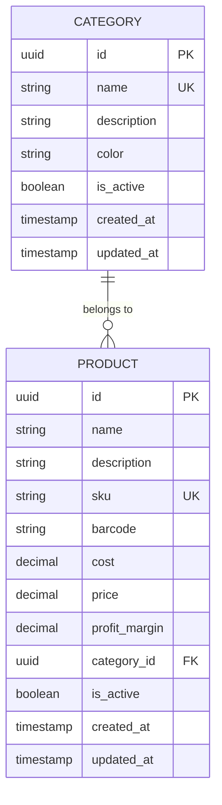

# Módulo: Productos

## 1. Descripción y Objetivo

### 1.1 Descripción
El módulo de Productos gestiona el catálogo completo de artículos comercializables. Permite crear, editar, categorizar y controlar los productos que se manejan en el negocio.

### 1.2 Objetivo
- Centralizar la información de todos los productos
- Gestionar costos, precios y márgenes de ganancia
- Facilitar la búsqueda y organización mediante categorías
- Mantener un control de estado (activo/inactivo) de productos
- Proporcionar información base para otros módulos (ventas, inventario, compras)

### 1.3 Funcionalidades Principales
- CRUD completo de productos
- Cálculo automático de precio de venta por porcentaje de ganancia
- Gestión de categorías
- Búsqueda y filtrado de productos
- Control de productos activos/inactivos
- Soporte para códigos de barras

---

## 2. Modelo de Datos

### 2.1 Diagrama ER



### 2.2 Entidades

#### 2.2.1 Product (Producto)

**Tabla**: `products`

| Campo | Tipo | Constraints | Descripción |
|-------|------|-------------|-------------|
| id | UUID | PK, Default: uuid_generate_v4() | Identificador único |
| name | VARCHAR(255) | NOT NULL | Nombre del producto |
| description | TEXT | NULL | Descripción detallada |
| sku | VARCHAR(100) | UNIQUE, NULL | Código de producto interno |
| barcode | VARCHAR(100) | NULL | Código de barras |
| cost | DECIMAL(10,2) | NOT NULL, CHECK (cost >= 0) | Costo del producto |
| price | DECIMAL(10,2) | NOT NULL, CHECK (price >= 0) | Precio de venta |
| profit_margin | DECIMAL(5,2) | NULL, CHECK (profit_margin >= 0) | Porcentaje de ganancia |
| category_id | UUID | FK → categories(id), NULL | Categoría del producto |
| is_active | BOOLEAN | NOT NULL, Default: true | Estado del producto |
| created_at | TIMESTAMP | NOT NULL, Default: CURRENT_TIMESTAMP | Fecha de creación |
| updated_at | TIMESTAMP | NOT NULL, Default: CURRENT_TIMESTAMP | Fecha de actualización |

**Índices:**
```sql
CREATE INDEX idx_products_name ON products(name);
CREATE INDEX idx_products_barcode ON products(barcode) WHERE barcode IS NOT NULL;
CREATE INDEX idx_products_category ON products(category_id);
CREATE INDEX idx_products_active ON products(is_active);
CREATE INDEX idx_products_search ON products USING gin(to_tsvector('spanish', name || ' ' || COALESCE(description, '')));
```

**Constraints adicionales:**
```sql
ALTER TABLE products ADD CONSTRAINT check_price_greater_than_cost 
  CHECK (price >= cost);
```

#### 2.2.2 Category (Categoría)

**Tabla**: `categories`

| Campo | Tipo | Constraints | Descripción |
|-------|------|-------------|-------------|
| id | UUID | PK, Default: uuid_generate_v4() | Identificador único |
| name | VARCHAR(100) | NOT NULL, UNIQUE | Nombre de la categoría |
| description | TEXT | NULL | Descripción |
| color | VARCHAR(7) | NULL | Color en HEX (#RRGGBB) |
| is_active | BOOLEAN | NOT NULL, Default: true | Estado de la categoría |
| created_at | TIMESTAMP | NOT NULL, Default: CURRENT_TIMESTAMP | Fecha de creación |
| updated_at | TIMESTAMP | NOT NULL, Default: CURRENT_TIMESTAMP | Fecha de actualización |

**Índices:**
```sql
CREATE INDEX idx_categories_name ON categories(name);
CREATE INDEX idx_categories_active ON categories(is_active);
```

---

## 3. Backend (NestJS)

### 3.1 Estructura de Carpetas

```
src/modules/products/
├── entities/
│   ├── product.entity.ts
│   └── category.entity.ts
├── dto/
│   ├── create-product.dto.ts
│   ├── update-product.dto.ts
│   ├── query-products.dto.ts
│   ├── create-category.dto.ts
│   ├── update-category.dto.ts
│   └── calculate-price.dto.ts
├── products.controller.ts
├── products.service.ts
├── products.repository.ts
├── categories.controller.ts
├── categories.service.ts
├── categories.repository.ts
└── products.module.ts
```

### 3.2 Entities (TypeORM)

#### 3.2.1 Product Entity

```typescript
// entities/product.entity.ts
import {
  Entity,
  PrimaryGeneratedColumn,
  Column,
  CreateDateColumn,
  UpdateDateColumn,
  ManyToOne,
  JoinColumn,
  Index,
  BeforeInsert,
  BeforeUpdate,
} from 'typeorm';
import { Category } from './category.entity';

@Entity('products')
@Index(['name'])
@Index(['barcode'])
@Index(['categoryId'])
@Index(['isActive'])
export class Product {
  @PrimaryGeneratedColumn('uuid')
  id: string;

  @Column({ type: 'varchar', length: 255 })
  name: string;

  @Column({ type: 'text', nullable: true })
  description: string;

  @Column({ type: 'varchar', length: 100, unique: true, nullable: true })
  sku: string;

  @Column({ type: 'varchar', length: 100, nullable: true })
  barcode: string;

  @Column({ 
    type: 'decimal', 
    precision: 10, 
    scale: 2,
    transformer: {
      to: (value: number) => value,
      from: (value: string) => parseFloat(value),
    },
  })
  cost: number;

  @Column({ 
    type: 'decimal', 
    precision: 10, 
    scale: 2,
    transformer: {
      to: (value: number) => value,
      from: (value: string) => parseFloat(value),
    },
  })
  price: number;

  @Column({ 
    type: 'decimal', 
    precision: 5, 
    scale: 2, 
    nullable: true,
    transformer: {
      to: (value: number) => value,
      from: (value: string) => value ? parseFloat(value) : null,
    },
  })
  profitMargin: number;

  @Column({ type: 'uuid', nullable: true })
  categoryId: string;

  @ManyToOne(() => Category, { eager: false, nullable: true })
  @JoinColumn({ name: 'category_id' })
  category: Category;

  @Column({ type: 'boolean', default: true })
  isActive: boolean;

  @CreateDateColumn({ type: 'timestamp' })
  createdAt: Date;

  @UpdateDateColumn({ type: 'timestamp' })
  updatedAt: Date;

  // Hook para calcular precio si hay margen de ganancia
  @BeforeInsert()
  @BeforeUpdate()
  calculatePriceFromMargin() {
    if (this.profitMargin && this.cost) {
      this.price = this.cost * (1 + this.profitMargin / 100);
      this.price = Math.round(this.price * 100) / 100; // Redondear a 2 decimales
    }
  }
}
```

#### 3.2.2 Category Entity

```typescript
// entities/category.entity.ts
import {
  Entity,
  PrimaryGeneratedColumn,
  Column,
  CreateDateColumn,
  UpdateDateColumn,
  OneToMany,
  Index,
} from 'typeorm';
import { Product } from './product.entity';

@Entity('categories')
@Index(['name'])
export class Category {
  @PrimaryGeneratedColumn('uuid')
  id: string;

  @Column({ type: 'varchar', length: 100, unique: true })
  name: string;

  @Column({ type: 'text', nullable: true })
  description: string;

  @Column({ type: 'varchar', length: 7, nullable: true })
  color: string;

  @Column({ type: 'boolean', default: true })
  isActive: boolean;

  @OneToMany(() => Product, (product) => product.category)
  products: Product[];

  @CreateDateColumn({ type: 'timestamp' })
  createdAt: Date;

  @UpdateDateColumn({ type: 'timestamp' })
  updatedAt: Date;
}
```

### 3.3 DTOs

#### 3.3.1 Product DTOs

```typescript
// dto/create-product.dto.ts
import { ApiProperty, ApiPropertyOptional } from '@nestjs/swagger';
import { z } from 'zod';

export const CreateProductSchema = z.object({
  name: z.string().min(1, 'El nombre es requerido').max(255),
  description: z.string().max(1000).optional(),
  sku: z.string().max(100).optional(),
  barcode: z.string().max(100).optional(),
  cost: z.number().positive('El costo debe ser mayor a 0'),
  price: z.number().positive('El precio debe ser mayor a 0').optional(),
  profitMargin: z.number().min(0).max(1000).optional(),
  categoryId: z.string().uuid().optional(),
  isActive: z.boolean().default(true),
}).refine(
  (data) => {
    // Si se proporciona price, debe ser mayor o igual al cost
    if (data.price !== undefined && data.price < data.cost) {
      return false;
    }
    // Debe proporcionar price O profitMargin (no ambos)
    if (data.price && data.profitMargin) {
      return false;
    }
    return true;
  },
  {
    message: 'Debe proporcionar precio O margen de ganancia (no ambos), y el precio debe ser mayor al costo',
  }
);

export type CreateProductDTO = z.infer<typeof CreateProductSchema>;

export class CreateProductDto implements CreateProductDTO {
  @ApiProperty({ example: 'Coca Cola 500ml' })
  name: string;

  @ApiPropertyOptional({ example: 'Gaseosa sabor cola' })
  description?: string;

  @ApiPropertyOptional({ example: 'PROD-001' })
  sku?: string;

  @ApiPropertyOptional({ example: '7790001234567' })
  barcode?: string;

  @ApiProperty({ example: 150.50 })
  cost: number;

  @ApiPropertyOptional({ example: 200.00 })
  price?: number;

  @ApiPropertyOptional({ example: 33.33, description: 'Porcentaje de ganancia' })
  profitMargin?: number;

  @ApiPropertyOptional({ format: 'uuid' })
  categoryId?: string;

  @ApiProperty({ example: true, default: true })
  isActive: boolean;
}
```

```typescript
// dto/update-product.dto.ts
import { z } from 'zod';
import { CreateProductSchema } from './create-product.dto';

export const UpdateProductSchema = CreateProductSchema.partial();

export type UpdateProductDTO = z.infer<typeof UpdateProductSchema>;

export class UpdateProductDto implements Partial<UpdateProductDTO> {
  @ApiPropertyOptional({ example: 'Coca Cola 500ml' })
  name?: string;

  @ApiPropertyOptional({ example: 'Gaseosa sabor cola' })
  description?: string;

  @ApiPropertyOptional({ example: 'PROD-001' })
  sku?: string;

  @ApiPropertyOptional({ example: '7790001234567' })
  barcode?: string;

  @ApiPropertyOptional({ example: 150.50 })
  cost?: number;

  @ApiPropertyOptional({ example: 200.00 })
  price?: number;

  @ApiPropertyOptional({ example: 33.33 })
  profitMargin?: number;

  @ApiPropertyOptional({ format: 'uuid' })
  categoryId?: string;

  @ApiPropertyOptional({ example: true })
  isActive?: boolean;
}
```

```typescript
// dto/query-products.dto.ts
import { z } from 'zod';
import { ApiPropertyOptional } from '@nestjs/swagger';

export const QueryProductsSchema = z.object({
  page: z.coerce.number().int().positive().default(1),
  limit: z.coerce.number().int().positive().max(100).default(10),
  search: z.string().optional(),
  categoryId: z.string().uuid().optional(),
  isActive: z.coerce.boolean().optional(),
  sortBy: z.enum(['name', 'price', 'cost', 'createdAt']).default('name'),
  order: z.enum(['ASC', 'DESC']).default('ASC'),
});

export type QueryProductsDTO = z.infer<typeof QueryProductsSchema>;

export class QueryProductsDto implements QueryProductsDTO {
  @ApiPropertyOptional({ example: 1 })
  page: number;

  @ApiPropertyOptional({ example: 10 })
  limit: number;

  @ApiPropertyOptional({ example: 'coca cola' })
  search?: string;

  @ApiPropertyOptional({ format: 'uuid' })
  categoryId?: string;

  @ApiPropertyOptional({ example: true })
  isActive?: boolean;

  @ApiPropertyOptional({ enum: ['name', 'price', 'cost', 'createdAt'] })
  sortBy: 'name' | 'price' | 'cost' | 'createdAt';

  @ApiPropertyOptional({ enum: ['ASC', 'DESC'] })
  order: 'ASC' | 'DESC';
}
```

```typescript
// dto/calculate-price.dto.ts
import { z } from 'zod';
import { ApiProperty } from '@nestjs/swagger';

export const CalculatePriceSchema = z.object({
  cost: z.number().positive('El costo debe ser mayor a 0'),
  profitMargin: z.number().min(0).max(1000),
});

export type CalculatePriceDTO = z.infer<typeof CalculatePriceSchema>;

export class CalculatePriceDto implements CalculatePriceDTO {
  @ApiProperty({ example: 150.50 })
  cost: number;

  @ApiProperty({ example: 33.33 })
  profitMargin: number;
}

export class CalculatePriceResponseDto {
  @ApiProperty({ example: 150.50 })
  cost: number;

  @ApiProperty({ example: 33.33 })
  profitMargin: number;

  @ApiProperty({ example: 200.50 })
  price: number;
}
```

#### 3.3.2 Category DTOs

```typescript
// dto/create-category.dto.ts
import { z } from 'zod';
import { ApiProperty, ApiPropertyOptional } from '@nestjs/swagger';

export const CreateCategorySchema = z.object({
  name: z.string().min(1, 'El nombre es requerido').max(100),
  description: z.string().max(500).optional(),
  color: z.string().regex(/^#[0-9A-Fa-f]{6}$/, 'Color inválido (formato: #RRGGBB)').optional(),
  isActive: z.boolean().default(true),
});

export type CreateCategoryDTO = z.infer<typeof CreateCategorySchema>;

export class CreateCategoryDto implements CreateCategoryDTO {
  @ApiProperty({ example: 'Bebidas' })
  name: string;

  @ApiPropertyOptional({ example: 'Bebidas gaseosas y jugos' })
  description?: string;

  @ApiPropertyOptional({ example: '#FF5733' })
  color?: string;

  @ApiProperty({ example: true, default: true })
  isActive: boolean;
}
```

```typescript
// dto/update-category.dto.ts
import { z } from 'zod';
import { CreateCategorySchema } from './create-category.dto';

export const UpdateCategorySchema = CreateCategorySchema.partial();

export type UpdateCategoryDTO = z.infer<typeof UpdateCategorySchema>;
```

### 3.4 Repository

```typescript
// products.repository.ts
import { Injectable } from '@nestjs/common';
import { DataSource, Repository } from 'typeorm';
import { Product } from './entities/product.entity';
import { QueryProductsDTO } from './dto/query-products.dto';

@Injectable()
export class ProductsRepository extends Repository<Product> {
  constructor(private dataSource: DataSource) {
    super(Product, dataSource.createEntityManager());
  }

  async findWithFilters(
    filters: QueryProductsDTO,
  ): Promise<[Product[], number]> {
    const { page, limit, search, categoryId, isActive, sortBy, order } = filters;

    const query = this.createQueryBuilder('product')
      .leftJoinAndSelect('product.category', 'category');

    // Búsqueda por texto
    if (search) {
      query.andWhere(
        '(product.name ILIKE :search OR product.description ILIKE :search OR product.sku ILIKE :search OR product.barcode ILIKE :search)',
        { search: `%${search}%` },
      );
    }

    // Filtro por categoría
    if (categoryId) {
      query.andWhere('product.categoryId = :categoryId', { categoryId });
    }

    // Filtro por estado
    if (isActive !== undefined) {
      query.andWhere('product.isActive = :isActive', { isActive });
    }

    // Ordenamiento
    query.orderBy(`product.${sortBy}`, order);

    // Paginación
    query.skip((page - 1) * limit).take(limit);

    return query.getManyAndCount();
  }

  async findByBarcode(barcode: string): Promise<Product | null> {
    return this.findOne({ where: { barcode } });
  }

  async findBySku(sku: string): Promise<Product | null> {
    return this.findOne({ where: { sku } });
  }

  async findActiveProducts(): Promise<Product[]> {
    return this.find({
      where: { isActive: true },
      relations: ['category'],
      order: { name: 'ASC' },
    });
  }
}
```

```typescript
// categories.repository.ts
import { Injectable } from '@nestjs/common';
import { DataSource, Repository } from 'typeorm';
import { Category } from './entities/category.entity';

@Injectable()
export class CategoriesRepository extends Repository<Category> {
  constructor(private dataSource: DataSource) {
    super(Category, dataSource.createEntityManager());
  }

  async findActiveCategories(): Promise<Category[]> {
    return this.find({
      where: { isActive: true },
      order: { name: 'ASC' },
    });
  }

  async findByName(name: string): Promise<Category | null> {
    return this.findOne({ where: { name } });
  }
}
```

### 3.5 Service

```typescript
// products.service.ts
import {
  Injectable,
  NotFoundException,
  ConflictException,
  BadRequestException,
} from '@nestjs/common';
import { ProductsRepository } from './products.repository';
import { CategoriesRepository } from './categories.repository';
import {
  CreateProductDTO,
  UpdateProductDTO,
  QueryProductsDTO,
  CalculatePriceDTO,
} from './dto';

@Injectable()
export class ProductsService {
  constructor(
    private readonly productsRepository: ProductsRepository,
    private readonly categoriesRepository: CategoriesRepository,
  ) {}

  async create(dto: CreateProductDTO) {
    // Validar SKU único si se proporciona
    if (dto.sku) {
      const existingSku = await this.productsRepository.findBySku(dto.sku);
      if (existingSku) {
        throw new ConflictException('El SKU ya existe');
      }
    }

    // Validar barcode único si se proporciona
    if (dto.barcode) {
      const existingBarcode = await this.productsRepository.findByBarcode(dto.barcode);
      if (existingBarcode) {
        throw new ConflictException('El código de barras ya existe');
      }
    }

    // Validar que la categoría existe si se proporciona
    if (dto.categoryId) {
      const category = await this.categoriesRepository.findOne({
        where: { id: dto.categoryId },
      });
      if (!category) {
        throw new NotFoundException('Categoría no encontrada');
      }
    }

    // Calcular precio si se proporciona margen de ganancia
    let finalPrice = dto.price;
    if (dto.profitMargin && !dto.price) {
      finalPrice = this.calculatePrice(dto.cost, dto.profitMargin);
    }

    const product = this.productsRepository.create({
      ...dto,
      price: finalPrice,
    });

    return this.productsRepository.save(product);
  }

  async findAll(filters: QueryProductsDTO) {
    const [data, total] = await this.productsRepository.findWithFilters(filters);

    return {
      data,
      total,
      page: filters.page,
      limit: filters.limit,
      totalPages: Math.ceil(total / filters.limit),
    };
  }

  async findOne(id: string) {
    const product = await this.productsRepository.findOne({
      where: { id },
      relations: ['category'],
    });

    if (!product) {
      throw new NotFoundException('Producto no encontrado');
    }

    return product;
  }

  async update(id: string, dto: UpdateProductDTO) {
    const product = await this.findOne(id);

    // Validar SKU único si se modifica
    if (dto.sku && dto.sku !== product.sku) {
      const existingSku = await this.productsRepository.findBySku(dto.sku);
      if (existingSku) {
        throw new ConflictException('El SKU ya existe');
      }
    }

    // Validar barcode único si se modifica
    if (dto.barcode && dto.barcode !== product.barcode) {
      const existingBarcode = await this.productsRepository.findByBarcode(dto.barcode);
      if (existingBarcode) {
        throw new ConflictException('El código de barras ya existe');
      }
    }

    // Validar categoría si se modifica
    if (dto.categoryId) {
      const category = await this.categoriesRepository.findOne({
        where: { id: dto.categoryId },
      });
      if (!category) {
        throw new NotFoundException('Categoría no encontrada');
      }
    }

    // Calcular precio si se modifica margen de ganancia
    if (dto.profitMargin !== undefined) {
      const cost = dto.cost ?? product.cost;
      dto.price = this.calculatePrice(cost, dto.profitMargin);
    }

    Object.assign(product, dto);
    return this.productsRepository.save(product);
  }

  async remove(id: string) {
    const product = await this.findOne(id);
    
    // Soft delete - solo marcar como inactivo
    product.isActive = false;
    await this.productsRepository.save(product);

    return { message: 'Producto desactivado exitosamente' };
  }

  async calculatePriceFromMargin(dto: CalculatePriceDTO) {
    const price = this.calculatePrice(dto.cost, dto.profitMargin);
    return {
      cost: dto.cost,
      profitMargin: dto.profitMargin,
      price,
    };
  }

  private calculatePrice(cost: number, profitMargin: number): number {
    const price = cost * (1 + profitMargin / 100);
    return Math.round(price * 100) / 100; // Redondear a 2 decimales
  }
}
```

```typescript
// categories.service.ts
import {
  Injectable,
  NotFoundException,
  ConflictException,
} from '@nestjs/common';
import { CategoriesRepository } from './categories.repository';
import { CreateCategoryDTO, UpdateCategoryDTO } from './dto';

@Injectable()
export class CategoriesService {
  constructor(
    private readonly categoriesRepository: CategoriesRepository,
  ) {}

  async create(dto: CreateCategoryDTO) {
    // Validar nombre único
    const existing = await this.categoriesRepository.findByName(dto.name);
    if (existing) {
      throw new ConflictException('Ya existe una categoría con ese nombre');
    }

    const category = this.categoriesRepository.create(dto);
    return this.categoriesRepository.save(category);
  }

  async findAll() {
    return this.categoriesRepository.find({
      order: { name: 'ASC' },
    });
  }

  async findActive() {
    return this.categoriesRepository.findActiveCategories();
  }

  async findOne(id: string) {
    const category = await this.categoriesRepository.findOne({
      where: { id },
      relations: ['products'],
    });

    if (!category) {
      throw new NotFoundException('Categoría no encontrada');
    }

    return category;
  }

  async update(id: string, dto: UpdateCategoryDTO) {
    const category = await this.findOne(id);

    // Validar nombre único si se modifica
    if (dto.name && dto.name !== category.name) {
      const existing = await this.categoriesRepository.findByName(dto.name);
      if (existing) {
        throw new ConflictException('Ya existe una categoría con ese nombre');
      }
    }

    Object.assign(category, dto);
    return this.categoriesRepository.save(category);
  }

  async remove(id: string) {
    const category = await this.findOne(id);
    
    // Verificar si tiene productos asociados
    if (category.products && category.products.length > 0) {
      throw new ConflictException(
        'No se puede eliminar una categoría con productos asociados',
      );
    }

    await this.categoriesRepository.remove(category);
    return { message: 'Categoría eliminada exitosamente' };
  }
}
```

### 3.6 Controllers

```typescript
// products.controller.ts
import {
  Controller,
  Get,
  Post,
  Body,
  Patch,
  Param,
  Delete,
  Query,
  UseGuards,
} from '@nestjs/common';
import {
  ApiTags,
  ApiOperation,
  ApiResponse,
  ApiBearerAuth,
  ApiQuery,
} from '@nestjs/swagger';
import { ProductsService } from './products.service';
import { ZodValidationPipe } from '@/common/pipes/zod-validation.pipe';
import {
  CreateProductDto,
  UpdateProductDto,
  QueryProductsDto,
  CalculatePriceDto,
  CreateProductSchema,
  UpdateProductSchema,
  QueryProductsSchema,
  CalculatePriceSchema,
} from './dto';
import { JwtAuthGuard } from '@/common/guards/jwt-auth.guard';

@ApiTags('products')
@Controller('products')
@UseGuards(JwtAuthGuard)
@ApiBearerAuth('JWT-auth')
export class ProductsController {
  constructor(private readonly productsService: ProductsService) {}

  @Post()
  @ApiOperation({ summary: 'Crear nuevo producto' })
  @ApiResponse({ status: 201, description: 'Producto creado exitosamente' })
  @ApiResponse({ status: 400, description: 'Datos inválidos' })
  @ApiResponse({ status: 409, description: 'SKU o código de barras duplicado' })
  create(
    @Body(new ZodValidationPipe(CreateProductSchema)) dto: CreateProductDto,
  ) {
    return this.productsService.create(dto);
  }

  @Get()
  @ApiOperation({ summary: 'Listar productos con filtros' })
  @ApiQuery({ name: 'page', required: false, type: Number })
  @ApiQuery({ name: 'limit', required: false, type: Number })
  @ApiQuery({ name: 'search', required: false, type: String })
  @ApiQuery({ name: 'categoryId', required: false, type: String })
  @ApiQuery({ name: 'isActive', required: false, type: Boolean })
  @ApiQuery({ name: 'sortBy', required: false, enum: ['name', 'price', 'cost', 'createdAt'] })
  @ApiQuery({ name: 'order', required: false, enum: ['ASC', 'DESC'] })
  @ApiResponse({ status: 200, description: 'Lista de productos' })
  findAll(
    @Query(new ZodValidationPipe(QueryProductsSchema)) query: QueryProductsDto,
  ) {
    return this.productsService.findAll(query);
  }

  @Get(':id')
  @ApiOperation({ summary: 'Obtener producto por ID' })
  @ApiResponse({ status: 200, description: 'Producto encontrado' })
  @ApiResponse({ status: 404, description: 'Producto no encontrado' })
  findOne(@Param('id') id: string) {
    return this.productsService.findOne(id);
  }

  @Patch(':id')
  @ApiOperation({ summary: 'Actualizar producto' })
  @ApiResponse({ status: 200, description: 'Producto actualizado' })
  @ApiResponse({ status: 404, description: 'Producto no encontrado' })
  @ApiResponse({ status: 409, description: 'SKU o código de barras duplicado' })
  update(
    @Param('id') id: string,
    @Body(new ZodValidationPipe(UpdateProductSchema)) dto: UpdateProductDto,
  ) {
    return this.productsService.update(id, dto);
  }

  @Delete(':id')
  @ApiOperation({ summary: 'Desactivar producto (soft delete)' })
  @ApiResponse({ status: 200, description: 'Producto desactivado' })
  @ApiResponse({ status: 404, description: 'Producto no encontrado' })
  remove(@Param('id') id: string) {
    return this.productsService.remove(id);
  }

  @Post('calculate-price')
  @ApiOperation({ summary: 'Calcular precio de venta a partir del costo y margen' })
  @ApiResponse({ status: 200, description: 'Precio calculado' })
  calculatePrice(
    @Body(new ZodValidationPipe(CalculatePriceSchema)) dto: CalculatePriceDto,
  ) {
    return this.productsService.calculatePriceFromMargin(dto);
  }
}
```

```typescript
// categories.controller.ts
import {
  Controller,
  Get,
  Post,
  Body,
  Patch,
  Param,
  Delete,
  UseGuards,
} from '@nestjs/common';
import {
  ApiTags,
  ApiOperation,
  ApiResponse,
  ApiBearerAuth,
} from '@nestjs/swagger';
import { CategoriesService } from './categories.service';
import { ZodValidationPipe } from '@/common/pipes/zod-validation.pipe';
import {
  CreateCategoryDto,
  UpdateCategoryDto,
  CreateCategorySchema,
  UpdateCategorySchema,
} from './dto';
import { JwtAuthGuard } from '@/common/guards/jwt-auth.guard';

@ApiTags('categories')
@Controller('categories')
@UseGuards(JwtAuthGuard)
@ApiBearerAuth('JWT-auth')
export class CategoriesController {
  constructor(private readonly categoriesService: CategoriesService) {}

  @Post()
  @ApiOperation({ summary: 'Crear nueva categoría' })
  @ApiResponse({ status: 201, description: 'Categoría creada exitosamente' })
  @ApiResponse({ status: 409, description: 'Nombre duplicado' })
  create(
    @Body(new ZodValidationPipe(CreateCategorySchema)) dto: CreateCategoryDto,
  ) {
    return this.categoriesService.create(dto);
  }

  @Get()
  @ApiOperation({ summary: 'Listar todas las categorías' })
  @ApiResponse({ status: 200, description: 'Lista de categorías' })
  findAll() {
    return this.categoriesService.findAll();
  }

  @Get('active')
  @ApiOperation({ summary: 'Listar categorías activas' })
  @ApiResponse({ status: 200, description: 'Lista de categorías activas' })
  findActive() {
    return this.categoriesService.findActive();
  }

  @Get(':id')
  @ApiOperation({ summary: 'Obtener categoría por ID' })
  @ApiResponse({ status: 200, description: 'Categoría encontrada' })
  @ApiResponse({ status: 404, description: 'Categoría no encontrada' })
  findOne(@Param('id') id: string) {
    return this.categoriesService.findOne(id);
  }

  @Patch(':id')
  @ApiOperation({ summary: 'Actualizar categoría' })
  @ApiResponse({ status: 200, description: 'Categoría actualizada' })
  @ApiResponse({ status: 404, description: 'Categoría no encontrada' })
  @ApiResponse({ status: 409, description: 'Nombre duplicado' })
  update(
    @Param('id') id: string,
    @Body(new ZodValidationPipe(UpdateCategorySchema)) dto: UpdateCategoryDto,
  ) {
    return this.categoriesService.update(id, dto);
  }

  @Delete(':id')
  @ApiOperation({ summary: 'Eliminar categoría' })
  @ApiResponse({ status: 200, description: 'Categoría eliminada' })
  @ApiResponse({ status: 404, description: 'Categoría no encontrada' })
  @ApiResponse({ status: 409, description: 'Categoría tiene productos asociados' })
  remove(@Param('id') id: string) {
    return this.categoriesService.remove(id);
  }
}
```

### 3.7 Module

```typescript
// products.module.ts
import { Module } from '@nestjs/common';
import { TypeOrmModule } from '@nestjs/typeorm';
import { ProductsController } from './products.controller';
import { CategoriesController } from './categories.controller';
import { ProductsService } from './products.service';
import { CategoriesService } from './categories.service';
import { ProductsRepository } from './products.repository';
import { CategoriesRepository } from './categories.repository';
import { Product } from './entities/product.entity';
import { Category } from './entities/category.entity';

@Module({
  imports: [TypeOrmModule.forFeature([Product, Category])],
  controllers: [ProductsController, CategoriesController],
  providers: [
    ProductsService,
    CategoriesService,
    ProductsRepository,
    CategoriesRepository,
  ],
  exports: [ProductsService, CategoriesService],
})
export class ProductsModule {}
```

---

## 4. Frontend (React)

### 4.1 Estructura de Carpetas

```
src/features/products/
├── api/
│   ├── productsApi.ts
│   └── categoriesApi.ts
├── components/
│   ├── ProductList.tsx
│   ├── ProductCard.tsx
│   ├── ProductForm.tsx
│   ├── ProductFilters.tsx
│   ├── CategorySelect.tsx
│   ├── PriceCalculator.tsx
│   └── columns.tsx
├── hooks/
│   ├── useProducts.ts
│   ├── useProductMutations.ts
│   ├── useCategories.ts
│   └── useCategoryMutations.ts
├── types/
│   └── product.types.ts
├── schemas/
│   ├── product.schema.ts
│   └── category.schema.ts
└── pages/
    ├── ProductsPage.tsx
    ├── ProductFormPage.tsx
    └── CategoriesPage.tsx
```

### 4.2 Types

```typescript
// types/product.types.ts
export interface Product {
  id: string;
  name: string;
  description?: string;
  sku?: string;
  barcode?: string;
  cost: number;
  price: number;
  profitMargin?: number;
  categoryId?: string;
  category?: Category;
  isActive: boolean;
  createdAt: string;
  updatedAt: string;
}

export interface Category {
  id: string;
  name: string;
  description?: string;
  color?: string;
  isActive: boolean;
  createdAt: string;
  updatedAt: string;
}

export interface ProductFilters {
  page?: number;
  limit?: number;
  search?: string;
  categoryId?: string;
  isActive?: boolean;
  sortBy?: 'name' | 'price' | 'cost' | 'createdAt';
  order?: 'ASC' | 'DESC';
}

export interface PaginatedResponse<T> {
  data: T[];
  total: number;
  page: number;
  limit: number;
  totalPages: number;
}
```

### 4.3 API Services

```typescript
// api/productsApi.ts
import { apiClient } from '@/lib/api/axios.config';
import type { Product, ProductFilters, PaginatedResponse } from '../types';

export const productsApi = {
  getAll: (filters: ProductFilters): Promise<PaginatedResponse<Product>> => {
    return apiClient.get('/products', { params: filters });
  },

  getById: (id: string): Promise<Product> => {
    return apiClient.get(`/products/${id}`);
  },

  create: (data: Partial<Product>): Promise<Product> => {
    return apiClient.post('/products', data);
  },

  update: (id: string, data: Partial<Product>): Promise<Product> => {
    return apiClient.patch(`/products/${id}`, data);
  },

  delete: (id: string): Promise<void> => {
    return apiClient.delete(`/products/${id}`);
  },

  calculatePrice: (cost: number, profitMargin: number) => {
    return apiClient.post('/products/calculate-price', { cost, profitMargin });
  },
};
```

```typescript
// api/categoriesApi.ts
import { apiClient } from '@/lib/api/axios.config';
import type { Category } from '../types';

export const categoriesApi = {
  getAll: (): Promise<Category[]> => {
    return apiClient.get('/categories');
  },

  getActive: (): Promise<Category[]> => {
    return apiClient.get('/categories/active');
  },

  getById: (id: string): Promise<Category> => {
    return apiClient.get(`/categories/${id}`);
  },

  create: (data: Partial<Category>): Promise<Category> => {
    return apiClient.post('/categories', data);
  },

  update: (id: string, data: Partial<Category>): Promise<Category> => {
    return apiClient.patch(`/categories/${id}`, data);
  },

  delete: (id: string): Promise<void> => {
    return apiClient.delete(`/categories/${id}`);
  },
};
```

### 4.4 Custom Hooks

```typescript
// hooks/useProducts.ts
import { useQuery } from '@tanstack/react-query';
import { productsApi } from '../api/productsApi';
import type { ProductFilters } from '../types';

export function useProducts(filters: ProductFilters) {
  return useQuery({
    queryKey: ['products', filters],
    queryFn: () => productsApi.getAll(filters),
    keepPreviousData: true,
  });
}

export function useProduct(id: string) {
  return useQuery({
    queryKey: ['products', id],
    queryFn: () => productsApi.getById(id),
    enabled: !!id,
  });
}
```

```typescript
// hooks/useProductMutations.ts
import { useMutation, useQueryClient } from '@tanstack/react-query';
import { toast } from 'sonner';
import { productsApi } from '../api/productsApi';
import type { Product } from '../types';

export function useCreateProduct() {
  const queryClient = useQueryClient();

  return useMutation({
    mutationFn: (data: Partial<Product>) => productsApi.create(data),
    onSuccess: () => {
      queryClient.invalidateQueries({ queryKey: ['products'] });
      toast.success('Producto creado exitosamente');
    },
    onError: (error: any) => {
      toast.error(error.response?.data?.message || 'Error al crear producto');
    },
  });
}

export function useUpdateProduct() {
  const queryClient = useQueryClient();

  return useMutation({
    mutationFn: ({ id, data }: { id: string; data: Partial<Product> }) =>
      productsApi.update(id, data),
    onSuccess: (_, variables) => {
      queryClient.invalidateQueries({ queryKey: ['products'] });
      queryClient.invalidateQueries({ queryKey: ['products', variables.id] });
      toast.success('Producto actualizado exitosamente');
    },
    onError: (error: any) => {
      toast.error(error.response?.data?.message || 'Error al actualizar producto');
    },
  });
}

export function useDeleteProduct() {
  const queryClient = useQueryClient();

  return useMutation({
    mutationFn: (id: string) => productsApi.delete(id),
    onSuccess: () => {
      queryClient.invalidateQueries({ queryKey: ['products'] });
      toast.success('Producto desactivado exitosamente');
    },
    onError: (error: any) => {
      toast.error(error.response?.data?.message || 'Error al desactivar producto');
    },
  });
}
```

### 4.5 Componentes Principales

```tsx
// pages/ProductsPage.tsx
import { useState } from 'react';
import { Plus } from 'lucide-react';
import { Button } from '@/components/ui/button';
import { Card, CardContent } from '@/components/ui/card';
import { PageHeader } from '@/components/layout/PageHeader';
import { DataTable } from '@/components/common/DataTable';
import { LoadingState } from '@/components/common/LoadingState';
import { EmptyState } from '@/components/common/EmptyState';
import { ProductFilters } from '../components/ProductFilters';
import { ProductForm } from '../components/ProductForm';
import { useProducts } from '../hooks/useProducts';
import { columns } from '../components/columns';
import type { ProductFilters as Filters } from '../types';

export function ProductsPage() {
  const [filters, setFilters] = useState<Filters>({
    page: 1,
    limit: 10,
    sortBy: 'name',
    order: 'ASC',
  });
  const [dialogOpen, setDialogOpen] = useState(false);

  const { data, isLoading } = useProducts(filters);

  return (
    <div className="space-y-6">
      <PageHeader
        title="Productos"
        description="Gestione el catálogo de productos"
        action={
          <Button onClick={() => setDialogOpen(true)}>
            <Plus className="mr-2 h-4 w-4" />
            Nuevo Producto
          </Button>
        }
      />

      <Card>
        <CardContent className="pt-6">
          <ProductFilters filters={filters} onChange={setFilters} />
        </CardContent>
      </Card>

      <Card>
        <CardContent className="p-0">
          {isLoading ? (
            <LoadingState />
          ) : !data?.data.length ? (
            <EmptyState
              title="No hay productos"
              description="Comience creando su primer producto"
              action={{
                label: 'Crear Producto',
                onClick: () => setDialogOpen(true),
              }}
            />
          ) : (
            <DataTable
              columns={columns}
              data={data.data}
              searchKey="name"
            />
          )}
        </CardContent>
      </Card>

      <ProductForm open={dialogOpen} onOpenChange={setDialogOpen} />
    </div>
  );
}
```

### 4.6 Schemas Zod (Frontend)

```typescript
// schemas/product.schema.ts
import { z } from 'zod';

export const ProductSchema = z.object({
  name: z.string().min(1, 'El nombre es requerido').max(255),
  description: z.string().max(1000).optional(),
  sku: z.string().max(100).optional(),
  barcode: z.string().max(100).optional(),
  cost: z.number().positive('El costo debe ser mayor a 0'),
  price: z.number().positive('El precio debe ser mayor a 0').optional(),
  profitMargin: z.number().min(0).max(1000).optional(),
  categoryId: z.string().uuid().optional(),
  isActive: z.boolean().default(true),
});

export type ProductFormData = z.infer<typeof ProductSchema>;
```

---

## 5. Casos de Uso

### 5.1 Crear Producto

**Actor**: Usuario del sistema

**Precondiciones**:
- Usuario autenticado
- Permisos para crear productos

**Flujo principal**:
1. Usuario hace clic en "Nuevo Producto"
2. Sistema muestra formulario vacío
3. Usuario completa los datos:
   - Nombre (requerido)
   - Descripción (opcional)
   - SKU (opcional, único)
   - Código de barras (opcional, único)
   - Costo (requerido, > 0)
   - Precio de venta O Margen de ganancia (uno de los dos)
   - Categoría (opcional)
   - Estado activo/inactivo
4. Usuario hace clic en "Guardar"
5. Sistema valida los datos
6. Sistema guarda el producto
7. Sistema muestra mensaje de éxito
8. Sistema actualiza la lista de productos

**Flujos alternativos**:
- **3a. Usuario ingresa margen de ganancia**:
  - Sistema calcula automáticamente el precio de venta
  - Sistema muestra el precio calculado en tiempo real
- **5a. Validación falla**:
  - Sistema muestra errores específicos por campo
  - Usuario corrige los errores
  - Volver al paso 4
- **6a. SKU o código de barras duplicado**:
  - Sistema muestra error de conflicto
  - Usuario modifica el valor duplicado
  - Volver al paso 4

**Postcondiciones**:
- Producto creado en la base de datos
- Producto visible en la lista

### 5.2 Buscar y Filtrar Productos

**Actor**: Usuario del sistema

**Precondiciones**:
- Usuario autenticado
- Existen productos en el sistema

**Flujo principal**:
1. Usuario accede a la lista de productos
2. Sistema muestra todos los productos activos paginados
3. Usuario puede:
   - Buscar por texto (nombre, descripción, SKU, código de barras)
   - Filtrar por categoría
   - Filtrar por estado (activo/inactivo)
   - Ordenar por nombre, precio, costo o fecha
4. Sistema actualiza la lista según los filtros aplicados

**Postcondiciones**:
- Lista filtrada mostrada al usuario

### 5.3 Actualizar Producto

**Actor**: Usuario del sistema

**Precondiciones**:
- Usuario autenticado
- Producto existe en el sistema
- Permisos para editar productos

**Flujo principal**:
1. Usuario hace clic en "Editar" en un producto
2. Sistema carga los datos actuales del producto
3. Sistema muestra formulario con datos pre-cargados
4. Usuario modifica los campos deseados
5. Usuario hace clic en "Guardar"
6. Sistema valida los datos
7. Sistema actualiza el producto
8. Sistema muestra mensaje de éxito
9. Sistema actualiza la lista

**Flujos alternativos**:
- **4a. Usuario modifica el margen de ganancia**:
  - Sistema recalcula el precio automáticamente
- **6a. Validación falla**:
  - Similar al caso de uso "Crear Producto"

### 5.4 Desactivar Producto

**Actor**: Usuario del sistema

**Precondiciones**:
- Usuario autenticado
- Producto existe y está activo
- Permisos para eliminar productos

**Flujo principal**:
1. Usuario hace clic en "Eliminar" en un producto
2. Sistema muestra diálogo de confirmación
3. Usuario confirma la acción
4. Sistema marca el producto como inactivo (soft delete)
5. Sistema muestra mensaje de éxito
6. Sistema actualiza la lista (producto ya no visible si el filtro está en "activos")

**Nota**: Se usa soft delete para mantener la integridad referencial con otros módulos (ventas, inventario).

### 5.5 Calcular Precio de Venta

**Actor**: Usuario del sistema

**Precondiciones**:
- Usuario está creando o editando un producto

**Flujo principal**:
1. Usuario ingresa el costo del producto
2. Usuario ingresa el margen de ganancia deseado (%)
3. Sistema calcula automáticamente: `precio = costo × (1 + margen/100)`
4. Sistema muestra el precio calculado
5. Usuario puede ajustar manualmente el precio si lo desea

**Regla de negocio**:
- El precio de venta siempre debe ser >= al costo
- El precio se redondea a 2 decimales

---

## 6. Consideraciones Técnicas

### 6.1 Validaciones de Negocio

1. **Unicidad**:
   - SKU debe ser único si se proporciona
   - Código de barras debe ser único si se proporciona
   - Nombre de categoría debe ser único

2. **Relaciones**:
   - Un producto puede tener 0 o 1 categoría
   - Una categoría puede tener múltiples productos
   - No se puede eliminar una categoría con productos asociados

3. **Precios**:
   - El costo debe ser mayor a 0
   - El precio debe ser mayor a 0
   - El precio debe ser >= al costo
   - Se puede proporcionar precio O margen de ganancia, no ambos

4. **Estados**:
   - Los productos inactivos no se eliminan físicamente (soft delete)
   - Los productos inactivos no deberían aparecer en el selector de productos de otros módulos

### 6.2 Optimizaciones

1. **Índices de Base de Datos**:
   - Índice en `name` para búsquedas y ordenamiento
   - Índice en `barcode` para búsqueda rápida por código de barras
   - Índice en `category_id` para filtros por categoría
   - Índice full-text search para búsquedas de texto

2. **Caching**:
   - Cachear lista de categorías activas (cambian poco)
   - React Query con staleTime de 5 minutos para productos

3. **Performance**:
   - Paginación en backend
   - Lazy loading de la relación con categoría cuando no es necesaria

### 6.3 Seguridad

1. **Autenticación**:
   - Todos los endpoints requieren JWT válido
   - Guard de NestJS para proteger rutas

2. **Autorización** (para implementar en futuro):
   - Roles: Admin puede crear/editar/eliminar
   - Roles: Vendedor puede solo consultar

3. **Validación**:
   - Validación en frontend (UX)
   - Validación en backend (seguridad)
   - Sanitización de inputs

### 6.4 Integraciones con Otros Módulos

Este módulo será consumido por:

1. **Módulo de Inventario**:
   - Necesita información de productos para registrar stock
   - Relación: inventario.productId → products.id

2. **Módulo de Ventas**:
   - Necesita lista de productos activos para vender
   - Necesita precios actualizados
   - Relación: sale_items.productId → products.id

3. **Módulo de Compras**:
   - Necesita productos para registrar compras
   - Relación: purchase_items.productId → products.id

4. **Módulo de Reportes**:
   - Consulta productos más vendidos
   - Consulta información de productos para reportes

**Exportaciones del módulo**:
```typescript
// ProductsModule exports ProductsService y CategoriesService
// Otros módulos pueden inyectarlos para consultar productos
```

---

## 7. Testing

### 7.1 Tests Unitarios (Backend)

```typescript
// products.service.spec.ts
describe('ProductsService', () => {
  it('should create a product with calculated price from margin', async () => {
    const dto = {
      name: 'Test Product',
      cost: 100,
      profitMargin: 50, // 50%
      isActive: true,
    };

    const result = await service.create(dto);

    expect(result.price).toBe(150); // 100 * 1.5
  });

  it('should throw ConflictException if SKU exists', async () => {
    // Test de SKU duplicado
  });

  it('should throw NotFoundException if category does not exist', async () => {
    // Test de categoría inexistente
  });
});
```

### 7.2 Tests de Integración (E2E)

```typescript
// products.e2e-spec.ts
describe('Products (e2e)', () => {
  it('/products (POST) should create a product', () => {
    return request(app.getHttpServer())
      .post('/products')
      .set('Authorization', `Bearer ${token}`)
      .send({
        name: 'Test Product',
        cost: 100,
        price: 150,
        isActive: true,
      })
      .expect(201)
      .expect((res) => {
        expect(res.body).toHaveProperty('id');
        expect(res.body.name).toBe('Test Product');
      });
  });
});
```

### 7.3 Tests Frontend

```typescript
// ProductForm.test.tsx
describe('ProductForm', () => {
  it('calculates price when profit margin changes', () => {
    render(<ProductForm />);
    
    fireEvent.change(screen.getByLabelText('Costo'), {
      target: { value: '100' },
    });
    
    fireEvent.change(screen.getByLabelText('Margen de Ganancia'), {
      target: { value: '50' },
    });
    
    expect(screen.getByLabelText('Precio')).toHaveValue('150.00');
  });
});
```

---

## 8. Próximos Pasos

1. **Implementación**:
   - Crear migraciones de base de datos
   - Implementar entities y DTOs
   - Implementar services con lógica de negocio
   - Implementar controllers
   - Crear componentes frontend

2. **Testing**:
   - Escribir tests unitarios
   - Escribir tests e2e
   - Tests de integración con otros módulos

3. **Documentación**:
   - Generar documentación Swagger
   - Documentar casos de uso especiales
   - Crear guía de usuario

4. **Integración**:
   - Este módulo está listo para integrarse con:
     - Módulo de Inventario (próximo a desarrollar)
     - Módulo de Ventas
     - Módulo de Compras

---

**Módulo completamente independiente y listo para desarrollo**
