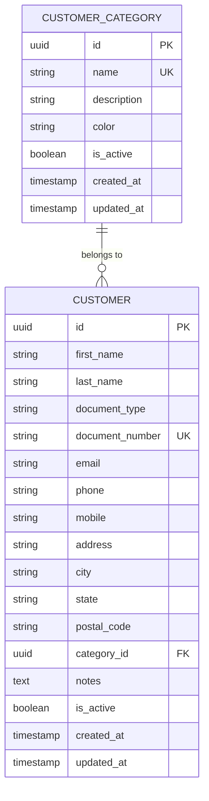

# Módulo: Clientes

## 1. Descripción y Objetivo

### 1.1 Descripción
El módulo de Clientes gestiona toda la información de los clientes del negocio. Permite registrar datos de contacto, categorizar clientes y mantener un historial de la relación comercial. Es la base para los módulos de Ventas y Cuentas Corrientes.

### 1.2 Objetivo
- Centralizar información de clientes
- Mantener datos de contacto actualizados
- Categorizar clientes por tipo o segmento
- Facilitar búsqueda rápida de clientes
- Proporcionar base de datos para ventas y cuenta corriente
- Controlar clientes activos/inactivos

### 1.3 Funcionalidades Principales
- CRUD completo de clientes
- Búsqueda avanzada por múltiples criterios
- Categorización de clientes
- Control de clientes activos/inactivos
- Validación de datos únicos (email, documento)
- Notas y observaciones sobre clientes

---

## 2. Modelo de Datos

### 2.1 Diagrama ER



### 2.2 Entidades

#### 2.2.1 Customer (Cliente)

**Tabla**: `customers`

| Campo | Tipo | Constraints | Descripción |
|-------|------|-------------|-------------|
| id | UUID | PK, Default: uuid_generate_v4() | Identificador único |
| first_name | VARCHAR(100) | NOT NULL | Nombre |
| last_name | VARCHAR(100) | NOT NULL | Apellido |
| document_type | VARCHAR(20) | NULL | Tipo de documento (DNI, CUIT, etc.) |
| document_number | VARCHAR(50) | UNIQUE, NULL | Número de documento |
| email | VARCHAR(255) | NULL | Email del cliente |
| phone | VARCHAR(20) | NULL | Teléfono fijo |
| mobile | VARCHAR(20) | NULL | Teléfono móvil |
| address | VARCHAR(255) | NULL | Dirección |
| city | VARCHAR(100) | NULL | Ciudad |
| state | VARCHAR(100) | NULL | Provincia/Estado |
| postal_code | VARCHAR(20) | NULL | Código postal |
| category_id | UUID | FK → customer_categories(id), NULL | Categoría del cliente |
| notes | TEXT | NULL | Notas y observaciones |
| is_active | BOOLEAN | NOT NULL, Default: true | Estado del cliente |
| created_at | TIMESTAMP | NOT NULL, Default: CURRENT_TIMESTAMP | Fecha de creación |
| updated_at | TIMESTAMP | NOT NULL, Default: CURRENT_TIMESTAMP | Fecha de actualización |

**Índices:**
```sql
CREATE INDEX idx_customers_name ON customers(last_name, first_name);
CREATE UNIQUE INDEX idx_customers_document ON customers(document_number) WHERE document_number IS NOT NULL;
CREATE INDEX idx_customers_email ON customers(email) WHERE email IS NOT NULL;
CREATE INDEX idx_customers_category ON customers(category_id);
CREATE INDEX idx_customers_active ON customers(is_active);
CREATE INDEX idx_customers_search ON customers USING gin(
  to_tsvector('spanish', first_name || ' ' || last_name || ' ' || COALESCE(email, '') || ' ' || COALESCE(document_number, ''))
);
```

**Tipos de documento (Argentina)**:
- `DNI`: Documento Nacional de Identidad
- `CUIT`: Clave Única de Identificación Tributaria
- `CUIL`: Clave Única de Identificación Laboral
- `PASAPORTE`: Pasaporte
- `OTRO`: Otro tipo de documento

#### 2.2.2 CustomerCategory (Categoría de Cliente)

**Tabla**: `customer_categories`

| Campo | Tipo | Constraints | Descripción |
|-------|------|-------------|-------------|
| id | UUID | PK, Default: uuid_generate_v4() | Identificador único |
| name | VARCHAR(100) | NOT NULL, UNIQUE | Nombre de la categoría |
| description | TEXT | NULL | Descripción |
| color | VARCHAR(7) | NULL | Color en HEX (#RRGGBB) |
| is_active | BOOLEAN | NOT NULL, Default: true | Estado de la categoría |
| created_at | TIMESTAMP | NOT NULL, Default: CURRENT_TIMESTAMP | Fecha de creación |
| updated_at | TIMESTAMP | NOT NULL, Default: CURRENT_TIMESTAMP | Fecha de actualización |

**Índices:**
```sql
CREATE UNIQUE INDEX idx_customer_categories_name ON customer_categories(name);
CREATE INDEX idx_customer_categories_active ON customer_categories(is_active);
```

**Categorías sugeridas**:
- `VIP`: Clientes VIP con descuentos especiales
- `MAYORISTA`: Clientes mayoristas
- `MINORISTA`: Clientes minoristas
- `FRECUENTE`: Clientes frecuentes
- `OCASIONAL`: Clientes ocasionales

---

## 3. Backend (NestJS)

### 3.1 Estructura de Carpetas

```
src/modules/customers/
├── entities/
│   ├── customer.entity.ts
│   └── customer-category.entity.ts
├── dto/
│   ├── create-customer.dto.ts
│   ├── update-customer.dto.ts
│   ├── query-customers.dto.ts
│   ├── create-category.dto.ts
│   └── update-category.dto.ts
├── customers.controller.ts
├── customers.service.ts
├── customers.repository.ts
├── categories.controller.ts
├── categories.service.ts
├── categories.repository.ts
└── customers.module.ts
```

### 3.2 Entities (TypeORM)

#### 3.2.1 Customer Entity

```typescript
// entities/customer.entity.ts
import {
  Entity,
  PrimaryGeneratedColumn,
  Column,
  CreateDateColumn,
  UpdateDateColumn,
  ManyToOne,
  JoinColumn,
  Index,
} from 'typeorm';
import { CustomerCategory } from './customer-category.entity';

export enum DocumentType {
  DNI = 'DNI',
  CUIT = 'CUIT',
  CUIL = 'CUIL',
  PASAPORTE = 'PASAPORTE',
  OTRO = 'OTRO',
}

@Entity('customers')
@Index(['lastName', 'firstName'])
@Index(['documentNumber'])
@Index(['email'])
@Index(['categoryId'])
@Index(['isActive'])
export class Customer {
  @PrimaryGeneratedColumn('uuid')
  id: string;

  @Column({ type: 'varchar', length: 100 })
  firstName: string;

  @Column({ type: 'varchar', length: 100 })
  lastName: string;

  @Column({
    type: 'enum',
    enum: DocumentType,
    nullable: true,
  })
  documentType: DocumentType;

  @Column({ type: 'varchar', length: 50, unique: true, nullable: true })
  documentNumber: string;

  @Column({ type: 'varchar', length: 255, nullable: true })
  email: string;

  @Column({ type: 'varchar', length: 20, nullable: true })
  phone: string;

  @Column({ type: 'varchar', length: 20, nullable: true })
  mobile: string;

  @Column({ type: 'varchar', length: 255, nullable: true })
  address: string;

  @Column({ type: 'varchar', length: 100, nullable: true })
  city: string;

  @Column({ type: 'varchar', length: 100, nullable: true })
  state: string;

  @Column({ type: 'varchar', length: 20, nullable: true })
  postalCode: string;

  @Column({ type: 'uuid', nullable: true })
  categoryId: string;

  @ManyToOne(() => CustomerCategory, { eager: false, nullable: true })
  @JoinColumn({ name: 'category_id' })
  category: CustomerCategory;

  @Column({ type: 'text', nullable: true })
  notes: string;

  @Column({ type: 'boolean', default: true })
  isActive: boolean;

  @CreateDateColumn({ type: 'timestamp' })
  createdAt: Date;

  @UpdateDateColumn({ type: 'timestamp' })
  updatedAt: Date;

  // Virtual field
  get fullName(): string {
    return `${this.firstName} ${this.lastName}`;
  }
}
```

#### 3.2.2 CustomerCategory Entity

```typescript
// entities/customer-category.entity.ts
import {
  Entity,
  PrimaryGeneratedColumn,
  Column,
  CreateDateColumn,
  UpdateDateColumn,
  OneToMany,
  Index,
} from 'typeorm';
import { Customer } from './customer.entity';

@Entity('customer_categories')
@Index(['name'])
export class CustomerCategory {
  @PrimaryGeneratedColumn('uuid')
  id: string;

  @Column({ type: 'varchar', length: 100, unique: true })
  name: string;

  @Column({ type: 'text', nullable: true })
  description: string;

  @Column({ type: 'varchar', length: 7, nullable: true })
  color: string;

  @Column({ type: 'boolean', default: true })
  isActive: boolean;

  @OneToMany(() => Customer, (customer) => customer.category)
  customers: Customer[];

  @CreateDateColumn({ type: 'timestamp' })
  createdAt: Date;

  @UpdateDateColumn({ type: 'timestamp' })
  updatedAt: Date;
}
```

### 3.3 DTOs

#### 3.3.1 Customer DTOs

```typescript
// dto/create-customer.dto.ts
import { z } from 'zod';
import { ApiProperty, ApiPropertyOptional } from '@nestjs/swagger';

export const CreateCustomerSchema = z.object({
  firstName: z.string().min(1, 'El nombre es requerido').max(100),
  lastName: z.string().min(1, 'El apellido es requerido').max(100),
  documentType: z.enum(['DNI', 'CUIT', 'CUIL', 'PASAPORTE', 'OTRO']).optional(),
  documentNumber: z.string().max(50).optional(),
  email: z.string().email('Email inválido').max(255).optional(),
  phone: z.string().max(20).optional(),
  mobile: z.string().max(20).optional(),
  address: z.string().max(255).optional(),
  city: z.string().max(100).optional(),
  state: z.string().max(100).optional(),
  postalCode: z.string().max(20).optional(),
  categoryId: z.string().uuid().optional(),
  notes: z.string().max(5000).optional(),
  isActive: z.boolean().default(true),
});

export type CreateCustomerDTO = z.infer<typeof CreateCustomerSchema>;

export class CreateCustomerDto implements CreateCustomerDTO {
  @ApiProperty({ example: 'Juan' })
  firstName: string;

  @ApiProperty({ example: 'Pérez' })
  lastName: string;

  @ApiPropertyOptional({ enum: ['DNI', 'CUIT', 'CUIL', 'PASAPORTE', 'OTRO'] })
  documentType?: 'DNI' | 'CUIT' | 'CUIL' | 'PASAPORTE' | 'OTRO';

  @ApiPropertyOptional({ example: '12345678' })
  documentNumber?: string;

  @ApiPropertyOptional({ example: 'juan.perez@email.com' })
  email?: string;

  @ApiPropertyOptional({ example: '0341-4567890' })
  phone?: string;

  @ApiPropertyOptional({ example: '341-5123456' })
  mobile?: string;

  @ApiPropertyOptional({ example: 'Calle Falsa 123' })
  address?: string;

  @ApiPropertyOptional({ example: 'Rosario' })
  city?: string;

  @ApiPropertyOptional({ example: 'Santa Fe' })
  state?: string;

  @ApiPropertyOptional({ example: '2000' })
  postalCode?: string;

  @ApiPropertyOptional({ format: 'uuid' })
  categoryId?: string;

  @ApiPropertyOptional({ example: 'Cliente preferencial' })
  notes?: string;

  @ApiProperty({ example: true, default: true })
  isActive: boolean;
}
```

```typescript
// dto/update-customer.dto.ts
import { z } from 'zod';
import { CreateCustomerSchema } from './create-customer.dto';

export const UpdateCustomerSchema = CreateCustomerSchema.partial();

export type UpdateCustomerDTO = z.infer<typeof UpdateCustomerSchema>;
```

```typescript
// dto/query-customers.dto.ts
import { z } from 'zod';
import { ApiPropertyOptional } from '@nestjs/swagger';

export const QueryCustomersSchema = z.object({
  page: z.coerce.number().int().positive().default(1),
  limit: z.coerce.number().int().positive().max(100).default(10),
  search: z.string().optional(),
  categoryId: z.string().uuid().optional(),
  isActive: z.coerce.boolean().optional(),
  city: z.string().optional(),
  state: z.string().optional(),
  sortBy: z.enum(['firstName', 'lastName', 'email', 'createdAt']).default('lastName'),
  order: z.enum(['ASC', 'DESC']).default('ASC'),
});

export type QueryCustomersDTO = z.infer<typeof QueryCustomersSchema>;

export class QueryCustomersDto implements QueryCustomersDTO {
  @ApiPropertyOptional({ example: 1 })
  page: number;

  @ApiPropertyOptional({ example: 10 })
  limit: number;

  @ApiPropertyOptional({ example: 'juan perez' })
  search?: string;

  @ApiPropertyOptional({ format: 'uuid' })
  categoryId?: string;

  @ApiPropertyOptional({ example: true })
  isActive?: boolean;

  @ApiPropertyOptional({ example: 'Rosario' })
  city?: string;

  @ApiPropertyOptional({ example: 'Santa Fe' })
  state?: string;

  @ApiPropertyOptional({ enum: ['firstName', 'lastName', 'email', 'createdAt'] })
  sortBy: 'firstName' | 'lastName' | 'email' | 'createdAt';

  @ApiPropertyOptional({ enum: ['ASC', 'DESC'] })
  order: 'ASC' | 'DESC';
}
```

#### 3.3.2 Category DTOs

```typescript
// dto/create-category.dto.ts
import { z } from 'zod';
import { ApiProperty, ApiPropertyOptional } from '@nestjs/swagger';

export const CreateCategorySchema = z.object({
  name: z.string().min(1, 'El nombre es requerido').max(100),
  description: z.string().max(500).optional(),
  color: z.string().regex(/^#[0-9A-Fa-f]{6}$/, 'Color inválido (formato: #RRGGBB)').optional(),
  isActive: z.boolean().default(true),
});

export type CreateCategoryDTO = z.infer<typeof CreateCategorySchema>;

export class CreateCategoryDto implements CreateCategoryDTO {
  @ApiProperty({ example: 'VIP' })
  name: string;

  @ApiPropertyOptional({ example: 'Clientes VIP con descuentos especiales' })
  description?: string;

  @ApiPropertyOptional({ example: '#FF5733' })
  color?: string;

  @ApiProperty({ example: true, default: true })
  isActive: boolean;
}
```

```typescript
// dto/update-category.dto.ts
import { z } from 'zod';
import { CreateCategorySchema } from './create-category.dto';

export const UpdateCategorySchema = CreateCategorySchema.partial();

export type UpdateCategoryDTO = z.infer<typeof UpdateCategorySchema>;
```

### 3.4 Repository

```typescript
// customers.repository.ts
import { Injectable } from '@nestjs/common';
import { DataSource, Repository } from 'typeorm';
import { Customer } from './entities/customer.entity';
import { QueryCustomersDTO } from './dto/query-customers.dto';

@Injectable()
export class CustomersRepository extends Repository<Customer> {
  constructor(private dataSource: DataSource) {
    super(Customer, dataSource.createEntityManager());
  }

  async findWithFilters(
    filters: QueryCustomersDTO,
  ): Promise<[Customer[], number]> {
    const {
      page,
      limit,
      search,
      categoryId,
      isActive,
      city,
      state,
      sortBy,
      order,
    } = filters;

    const query = this.createQueryBuilder('customer')
      .leftJoinAndSelect('customer.category', 'category');

    // Búsqueda por texto (nombre, email, documento)
    if (search) {
      query.andWhere(
        '(customer.firstName ILIKE :search OR customer.lastName ILIKE :search OR customer.email ILIKE :search OR customer.documentNumber ILIKE :search)',
        { search: `%${search}%` },
      );
    }

    // Filtro por categoría
    if (categoryId) {
      query.andWhere('customer.categoryId = :categoryId', { categoryId });
    }

    // Filtro por estado
    if (isActive !== undefined) {
      query.andWhere('customer.isActive = :isActive', { isActive });
    }

    // Filtro por ciudad
    if (city) {
      query.andWhere('customer.city ILIKE :city', { city: `%${city}%` });
    }

    // Filtro por provincia
    if (state) {
      query.andWhere('customer.state ILIKE :state', { state: `%${state}%` });
    }

    // Ordenamiento
    query.orderBy(`customer.${sortBy}`, order);

    // Paginación
    query.skip((page - 1) * limit).take(limit);

    return query.getManyAndCount();
  }

  async findByDocumentNumber(documentNumber: string): Promise<Customer | null> {
    return this.findOne({ where: { documentNumber } });
  }

  async findByEmail(email: string): Promise<Customer | null> {
    return this.findOne({ where: { email } });
  }

  async findActiveCustomers(): Promise<Customer[]> {
    return this.find({
      where: { isActive: true },
      relations: ['category'],
      order: { lastName: 'ASC', firstName: 'ASC' },
    });
  }

  async getCustomerStats(): Promise<{
    total: number;
    active: number;
    inactive: number;
    byCategory: { categoryName: string; count: number }[];
  }> {
    const total = await this.count();
    const active = await this.count({ where: { isActive: true } });
    const inactive = total - active;

    const byCategory = await this.createQueryBuilder('customer')
      .leftJoin('customer.category', 'category')
      .select('category.name', 'categoryName')
      .addSelect('COUNT(customer.id)', 'count')
      .groupBy('category.name')
      .getRawMany();

    return {
      total,
      active,
      inactive,
      byCategory: byCategory.map((item) => ({
        categoryName: item.categoryName || 'Sin categoría',
        count: parseInt(item.count),
      })),
    };
  }
}
```

```typescript
// categories.repository.ts
import { Injectable } from '@nestjs/common';
import { DataSource, Repository } from 'typeorm';
import { CustomerCategory } from './entities/customer-category.entity';

@Injectable()
export class CategoriesRepository extends Repository<CustomerCategory> {
  constructor(private dataSource: DataSource) {
    super(CustomerCategory, dataSource.createEntityManager());
  }

  async findActiveCategories(): Promise<CustomerCategory[]> {
    return this.find({
      where: { isActive: true },
      order: { name: 'ASC' },
    });
  }

  async findByName(name: string): Promise<CustomerCategory | null> {
    return this.findOne({ where: { name } });
  }
}
```

### 3.5 Service

```typescript
// customers.service.ts
import {
  Injectable,
  NotFoundException,
  ConflictException,
} from '@nestjs/common';
import { CustomersRepository } from './customers.repository';
import { CategoriesRepository } from './categories.repository';
import {
  CreateCustomerDTO,
  UpdateCustomerDTO,
  QueryCustomersDTO,
} from './dto';

@Injectable()
export class CustomersService {
  constructor(
    private readonly customersRepository: CustomersRepository,
    private readonly categoriesRepository: CategoriesRepository,
  ) {}

  async create(dto: CreateCustomerDTO) {
    // Validar documento único si se proporciona
    if (dto.documentNumber) {
      const existingCustomer = await this.customersRepository.findByDocumentNumber(
        dto.documentNumber,
      );
      if (existingCustomer) {
        throw new ConflictException('El número de documento ya está registrado');
      }
    }

    // Validar email único si se proporciona
    if (dto.email) {
      const existingEmail = await this.customersRepository.findByEmail(dto.email);
      if (existingEmail) {
        throw new ConflictException('El email ya está registrado');
      }
    }

    // Validar que la categoría existe si se proporciona
    if (dto.categoryId) {
      const category = await this.categoriesRepository.findOne({
        where: { id: dto.categoryId },
      });
      if (!category) {
        throw new NotFoundException('Categoría no encontrada');
      }
    }

    const customer = this.customersRepository.create(dto);
    return this.customersRepository.save(customer);
  }

  async findAll(filters: QueryCustomersDTO) {
    const [data, total] = await this.customersRepository.findWithFilters(filters);

    return {
      data,
      total,
      page: filters.page,
      limit: filters.limit,
      totalPages: Math.ceil(total / filters.limit),
    };
  }

  async findOne(id: string) {
    const customer = await this.customersRepository.findOne({
      where: { id },
      relations: ['category'],
    });

    if (!customer) {
      throw new NotFoundException('Cliente no encontrado');
    }

    return customer;
  }

  async update(id: string, dto: UpdateCustomerDTO) {
    const customer = await this.findOne(id);

    // Validar documento único si se modifica
    if (dto.documentNumber && dto.documentNumber !== customer.documentNumber) {
      const existingCustomer = await this.customersRepository.findByDocumentNumber(
        dto.documentNumber,
      );
      if (existingCustomer) {
        throw new ConflictException('El número de documento ya está registrado');
      }
    }

    // Validar email único si se modifica
    if (dto.email && dto.email !== customer.email) {
      const existingEmail = await this.customersRepository.findByEmail(dto.email);
      if (existingEmail) {
        throw new ConflictException('El email ya está registrado');
      }
    }

    // Validar categoría si se modifica
    if (dto.categoryId) {
      const category = await this.categoriesRepository.findOne({
        where: { id: dto.categoryId },
      });
      if (!category) {
        throw new NotFoundException('Categoría no encontrada');
      }
    }

    Object.assign(customer, dto);
    return this.customersRepository.save(customer);
  }

  async remove(id: string) {
    const customer = await this.findOne(id);

    // Soft delete - solo marcar como inactivo
    customer.isActive = false;
    await this.customersRepository.save(customer);

    return { message: 'Cliente desactivado exitosamente' };
  }

  async getActiveCustomers() {
    return this.customersRepository.findActiveCustomers();
  }

  async getStats() {
    return this.customersRepository.getCustomerStats();
  }
}
```

```typescript
// categories.service.ts
import {
  Injectable,
  NotFoundException,
  ConflictException,
} from '@nestjs/common';
import { CategoriesRepository } from './categories.repository';
import { CreateCategoryDTO, UpdateCategoryDTO } from './dto';

@Injectable()
export class CategoriesService {
  constructor(
    private readonly categoriesRepository: CategoriesRepository,
  ) {}

  async create(dto: CreateCategoryDTO) {
    // Validar nombre único
    const existing = await this.categoriesRepository.findByName(dto.name);
    if (existing) {
      throw new ConflictException('Ya existe una categoría con ese nombre');
    }

    const category = this.categoriesRepository.create(dto);
    return this.categoriesRepository.save(category);
  }

  async findAll() {
    return this.categoriesRepository.find({
      order: { name: 'ASC' },
    });
  }

  async findActive() {
    return this.categoriesRepository.findActiveCategories();
  }

  async findOne(id: string) {
    const category = await this.categoriesRepository.findOne({
      where: { id },
      relations: ['customers'],
    });

    if (!category) {
      throw new NotFoundException('Categoría no encontrada');
    }

    return category;
  }

  async update(id: string, dto: UpdateCategoryDTO) {
    const category = await this.findOne(id);

    // Validar nombre único si se modifica
    if (dto.name && dto.name !== category.name) {
      const existing = await this.categoriesRepository.findByName(dto.name);
      if (existing) {
        throw new ConflictException('Ya existe una categoría con ese nombre');
      }
    }

    Object.assign(category, dto);
    return this.categoriesRepository.save(category);
  }

  async remove(id: string) {
    const category = await this.findOne(id);

    // Verificar si tiene clientes asociados
    if (category.customers && category.customers.length > 0) {
      throw new ConflictException(
        'No se puede eliminar una categoría con clientes asociados',
      );
    }

    await this.categoriesRepository.remove(category);
    return { message: 'Categoría eliminada exitosamente' };
  }
}
```

### 3.6 Controllers

```typescript
// customers.controller.ts
import {
  Controller,
  Get,
  Post,
  Body,
  Patch,
  Param,
  Delete,
  Query,
  UseGuards,
} from '@nestjs/common';
import {
  ApiTags,
  ApiOperation,
  ApiResponse,
  ApiBearerAuth,
  ApiQuery,
} from '@nestjs/swagger';
import { CustomersService } from './customers.service';
import { ZodValidationPipe } from '@/common/pipes/zod-validation.pipe';
import {
  CreateCustomerDto,
  UpdateCustomerDto,
  QueryCustomersDto,
  CreateCustomerSchema,
  UpdateCustomerSchema,
  QueryCustomersSchema,
} from './dto';
import { JwtAuthGuard } from '@/modules/auth/guards/jwt-auth.guard';

@ApiTags('customers')
@Controller('customers')
@UseGuards(JwtAuthGuard)
@ApiBearerAuth('JWT-auth')
export class CustomersController {
  constructor(private readonly customersService: CustomersService) {}

  @Post()
  @ApiOperation({ summary: 'Crear nuevo cliente' })
  @ApiResponse({ status: 201, description: 'Cliente creado exitosamente' })
  @ApiResponse({ status: 400, description: 'Datos inválidos' })
  @ApiResponse({ status: 409, description: 'Documento o email duplicado' })
  create(
    @Body(new ZodValidationPipe(CreateCustomerSchema)) dto: CreateCustomerDto,
  ) {
    return this.customersService.create(dto);
  }

  @Get()
  @ApiOperation({ summary: 'Listar clientes con filtros' })
  @ApiQuery({ name: 'page', required: false, type: Number })
  @ApiQuery({ name: 'limit', required: false, type: Number })
  @ApiQuery({ name: 'search', required: false, type: String })
  @ApiQuery({ name: 'categoryId', required: false, type: String })
  @ApiQuery({ name: 'isActive', required: false, type: Boolean })
  @ApiQuery({ name: 'city', required: false, type: String })
  @ApiQuery({ name: 'state', required: false, type: String })
  @ApiQuery({
    name: 'sortBy',
    required: false,
    enum: ['firstName', 'lastName', 'email', 'createdAt'],
  })
  @ApiQuery({ name: 'order', required: false, enum: ['ASC', 'DESC'] })
  @ApiResponse({ status: 200, description: 'Lista de clientes' })
  findAll(
    @Query(new ZodValidationPipe(QueryCustomersSchema)) query: QueryCustomersDto,
  ) {
    return this.customersService.findAll(query);
  }

  @Get('active')
  @ApiOperation({ summary: 'Listar clientes activos' })
  @ApiResponse({ status: 200, description: 'Lista de clientes activos' })
  getActiveCustomers() {
    return this.customersService.getActiveCustomers();
  }

  @Get('stats')
  @ApiOperation({ summary: 'Obtener estadísticas de clientes' })
  @ApiResponse({ status: 200, description: 'Estadísticas de clientes' })
  getStats() {
    return this.customersService.getStats();
  }

  @Get(':id')
  @ApiOperation({ summary: 'Obtener cliente por ID' })
  @ApiResponse({ status: 200, description: 'Cliente encontrado' })
  @ApiResponse({ status: 404, description: 'Cliente no encontrado' })
  findOne(@Param('id') id: string) {
    return this.customersService.findOne(id);
  }

  @Patch(':id')
  @ApiOperation({ summary: 'Actualizar cliente' })
  @ApiResponse({ status: 200, description: 'Cliente actualizado' })
  @ApiResponse({ status: 404, description: 'Cliente no encontrado' })
  @ApiResponse({ status: 409, description: 'Documento o email duplicado' })
  update(
    @Param('id') id: string,
    @Body(new ZodValidationPipe(UpdateCustomerSchema)) dto: UpdateCustomerDto,
  ) {
    return this.customersService.update(id, dto);
  }

  @Delete(':id')
  @ApiOperation({ summary: 'Desactivar cliente (soft delete)' })
  @ApiResponse({ status: 200, description: 'Cliente desactivado' })
  @ApiResponse({ status: 404, description: 'Cliente no encontrado' })
  remove(@Param('id') id: string) {
    return this.customersService.remove(id);
  }
}
```

```typescript
// categories.controller.ts
import {
  Controller,
  Get,
  Post,
  Body,
  Patch,
  Param,
  Delete,
  UseGuards,
} from '@nestjs/common';
import {
  ApiTags,
  ApiOperation,
  ApiResponse,
  ApiBearerAuth,
} from '@nestjs/swagger';
import { CategoriesService } from './categories.service';
import { ZodValidationPipe } from '@/common/pipes/zod-validation.pipe';
import {
  CreateCategoryDto,
  UpdateCategoryDto,
  CreateCategorySchema,
  UpdateCategorySchema,
} from './dto';
import { JwtAuthGuard } from '@/modules/auth/guards/jwt-auth.guard';

@ApiTags('customer-categories')
@Controller('customer-categories')
@UseGuards(JwtAuthGuard)
@ApiBearerAuth('JWT-auth')
export class CategoriesController {
  constructor(private readonly categoriesService: CategoriesService) {}

  @Post()
  @ApiOperation({ summary: 'Crear nueva categoría de cliente' })
  @ApiResponse({ status: 201, description: 'Categoría creada exitosamente' })
  @ApiResponse({ status: 409, description: 'Nombre duplicado' })
  create(
    @Body(new ZodValidationPipe(CreateCategorySchema)) dto: CreateCategoryDto,
  ) {
    return this.categoriesService.create(dto);
  }

  @Get()
  @ApiOperation({ summary: 'Listar todas las categorías' })
  @ApiResponse({ status: 200, description: 'Lista de categorías' })
  findAll() {
    return this.categoriesService.findAll();
  }

  @Get('active')
  @ApiOperation({ summary: 'Listar categorías activas' })
  @ApiResponse({ status: 200, description: 'Lista de categorías activas' })
  findActive() {
    return this.categoriesService.findActive();
  }

  @Get(':id')
  @ApiOperation({ summary: 'Obtener categoría por ID' })
  @ApiResponse({ status: 200, description: 'Categoría encontrada' })
  @ApiResponse({ status: 404, description: 'Categoría no encontrada' })
  findOne(@Param('id') id: string) {
    return this.categoriesService.findOne(id);
  }

  @Patch(':id')
  @ApiOperation({ summary: 'Actualizar categoría' })
  @ApiResponse({ status: 200, description: 'Categoría actualizada' })
  @ApiResponse({ status: 404, description: 'Categoría no encontrada' })
  @ApiResponse({ status: 409, description: 'Nombre duplicado' })
  update(
    @Param('id') id: string,
    @Body(new ZodValidationPipe(UpdateCategorySchema)) dto: UpdateCategoryDto,
  ) {
    return this.categoriesService.update(id, dto);
  }

  @Delete(':id')
  @ApiOperation({ summary: 'Eliminar categoría' })
  @ApiResponse({ status: 200, description: 'Categoría eliminada' })
  @ApiResponse({ status: 404, description: 'Categoría no encontrada' })
  @ApiResponse({
    status: 409,
    description: 'Categoría tiene clientes asociados',
  })
  remove(@Param('id') id: string) {
    return this.categoriesService.remove(id);
  }
}
```

### 3.7 Module

```typescript
// customers.module.ts
import { Module } from '@nestjs/common';
import { TypeOrmModule } from '@nestjs/typeorm';
import { CustomersController } from './customers.controller';
import { CategoriesController } from './categories.controller';
import { CustomersService } from './customers.service';
import { CategoriesService } from './categories.service';
import { CustomersRepository } from './customers.repository';
import { CategoriesRepository } from './categories.repository';
import { Customer } from './entities/customer.entity';
import { CustomerCategory } from './entities/customer-category.entity';

@Module({
  imports: [TypeOrmModule.forFeature([Customer, CustomerCategory])],
  controllers: [CustomersController, CategoriesController],
  providers: [
    CustomersService,
    CategoriesService,
    CustomersRepository,
    CategoriesRepository,
  ],
  exports: [CustomersService, CategoriesService],
})
export class CustomersModule {}
```

---

## 4. Frontend (React)

### 4.1 Estructura de Carpetas

```
src/features/customers/
├── api/
│   ├── customersApi.ts
│   └── categoriesApi.ts
├── components/
│   ├── CustomerList.tsx
│   ├── CustomerCard.tsx
│   ├── CustomerForm.tsx
│   ├── CustomerFilters.tsx
│   ├── CategorySelect.tsx
│   ├── CustomerStats.tsx
│   └── columns.tsx
├── hooks/
│   ├── useCustomers.ts
│   ├── useCustomerMutations.ts
│   ├── useCategories.ts
│   └── useCategoryMutations.ts
├── types/
│   └── customer.types.ts
├── schemas/
│   ├── customer.schema.ts
│   └── category.schema.ts
└── pages/
    ├── CustomersPage.tsx
    ├── CustomerFormPage.tsx
    ├── CustomerDetailPage.tsx
    └── CategoriesPage.tsx
```

### 4.2 Types

```typescript
// types/customer.types.ts
export interface Customer {
  id: string;
  firstName: string;
  lastName: string;
  fullName: string;
  documentType?: 'DNI' | 'CUIT' | 'CUIL' | 'PASAPORTE' | 'OTRO';
  documentNumber?: string;
  email?: string;
  phone?: string;
  mobile?: string;
  address?: string;
  city?: string;
  state?: string;
  postalCode?: string;
  categoryId?: string;
  category?: CustomerCategory;
  notes?: string;
  isActive: boolean;
  createdAt: string;
  updatedAt: string;
}

export interface CustomerCategory {
  id: string;
  name: string;
  description?: string;
  color?: string;
  isActive: boolean;
  createdAt: string;
  updatedAt: string;
}

export interface CustomerFilters {
  page?: number;
  limit?: number;
  search?: string;
  categoryId?: string;
  isActive?: boolean;
  city?: string;
  state?: string;
  sortBy?: 'firstName' | 'lastName' | 'email' | 'createdAt';
  order?: 'ASC' | 'DESC';
}

export interface CustomerStats {
  total: number;
  active: number;
  inactive: number;
  byCategory: Array<{
    categoryName: string;
    count: number;
  }>;
}

export interface PaginatedResponse<T> {
  data: T[];
  total: number;
  page: number;
  limit: number;
  totalPages: number;
}
```

### 4.3 Schemas

```typescript
// schemas/customer.schema.ts
import { z } from 'zod';

export const CustomerSchema = z.object({
  firstName: z.string().min(1, 'El nombre es requerido').max(100),
  lastName: z.string().min(1, 'El apellido es requerido').max(100),
  documentType: z.enum(['DNI', 'CUIT', 'CUIL', 'PASAPORTE', 'OTRO']).optional(),
  documentNumber: z.string().max(50).optional(),
  email: z.string().email('Email inválido').optional().or(z.literal('')),
  phone: z.string().max(20).optional(),
  mobile: z.string().max(20).optional(),
  address: z.string().max(255).optional(),
  city: z.string().max(100).optional(),
  state: z.string().max(100).optional(),
  postalCode: z.string().max(20).optional(),
  categoryId: z.string().uuid().optional().or(z.literal('')),
  notes: z.string().max(5000).optional(),
  isActive: z.boolean().default(true),
});

export type CustomerFormData = z.infer<typeof CustomerSchema>;
```

### 4.4 API Services

```typescript
// api/customersApi.ts
import { apiClient } from '@/lib/api/axios.config';
import type {
  Customer,
  CustomerFilters,
  CustomerStats,
  PaginatedResponse,
} from '../types';

export const customersApi = {
  getAll: (filters: CustomerFilters): Promise<PaginatedResponse<Customer>> => {
    return apiClient.get('/customers', { params: filters });
  },

  getActive: (): Promise<Customer[]> => {
    return apiClient.get('/customers/active');
  },

  getStats: (): Promise<CustomerStats> => {
    return apiClient.get('/customers/stats');
  },

  getById: (id: string): Promise<Customer> => {
    return apiClient.get(`/customers/${id}`);
  },

  create: (data: Partial<Customer>): Promise<Customer> => {
    return apiClient.post('/customers', data);
  },

  update: (id: string, data: Partial<Customer>): Promise<Customer> => {
    return apiClient.patch(`/customers/${id}`, data);
  },

  delete: (id: string): Promise<void> => {
    return apiClient.delete(`/customers/${id}`);
  },
};
```

### 4.5 Custom Hooks

```typescript
// hooks/useCustomers.ts
import { useQuery } from '@tanstack/react-query';
import { customersApi } from '../api/customersApi';
import type { CustomerFilters } from '../types';

export function useCustomers(filters: CustomerFilters) {
  return useQuery({
    queryKey: ['customers', filters],
    queryFn: () => customersApi.getAll(filters),
    keepPreviousData: true,
  });
}

export function useActiveCustomers() {
  return useQuery({
    queryKey: ['customers', 'active'],
    queryFn: () => customersApi.getActive(),
    staleTime: 5 * 60 * 1000,
  });
}

export function useCustomerStats() {
  return useQuery({
    queryKey: ['customers', 'stats'],
    queryFn: () => customersApi.getStats(),
    staleTime: 2 * 60 * 1000,
  });
}

export function useCustomer(id: string) {
  return useQuery({
    queryKey: ['customers', id],
    queryFn: () => customersApi.getById(id),
    enabled: !!id,
  });
}
```

```typescript
// hooks/useCustomerMutations.ts
import { useMutation, useQueryClient } from '@tanstack/react-query';
import { toast } from 'sonner';
import { customersApi } from '../api/customersApi';
import type { Customer } from '../types';

export function useCreateCustomer() {
  const queryClient = useQueryClient();

  return useMutation({
    mutationFn: (data: Partial<Customer>) => customersApi.create(data),
    onSuccess: () => {
      queryClient.invalidateQueries({ queryKey: ['customers'] });
      toast.success('Cliente creado exitosamente');
    },
    onError: (error: any) => {
      toast.error(error.response?.data?.message || 'Error al crear cliente');
    },
  });
}

export function useUpdateCustomer() {
  const queryClient = useQueryClient();

  return useMutation({
    mutationFn: ({ id, data }: { id: string; data: Partial<Customer> }) =>
      customersApi.update(id, data),
    onSuccess: (_, variables) => {
      queryClient.invalidateQueries({ queryKey: ['customers'] });
      queryClient.invalidateQueries({ queryKey: ['customers', variables.id] });
      toast.success('Cliente actualizado exitosamente');
    },
    onError: (error: any) => {
      toast.error(error.response?.data?.message || 'Error al actualizar cliente');
    },
  });
}

export function useDeleteCustomer() {
  const queryClient = useQueryClient();

  return useMutation({
    mutationFn: (id: string) => customersApi.delete(id),
    onSuccess: () => {
      queryClient.invalidateQueries({ queryKey: ['customers'] });
      toast.success('Cliente desactivado exitosamente');
    },
    onError: (error: any) => {
      toast.error(error.response?.data?.message || 'Error al desactivar cliente');
    },
  });
}
```

### 4.6 Componentes Principales

```tsx
// pages/CustomersPage.tsx
import { useState } from 'react';
import { Plus } from 'lucide-react';
import { Button } from '@/components/ui/button';
import { Card, CardContent } from '@/components/ui/card';
import { PageHeader } from '@/components/layout/PageHeader';
import { DataTable } from '@/components/common/DataTable';
import { LoadingState } from '@/components/common/LoadingState';
import { EmptyState } from '@/components/common/EmptyState';
import { CustomerFilters } from '../components/CustomerFilters';
import { CustomerStats } from '../components/CustomerStats';
import { CustomerForm } from '../components/CustomerForm';
import { useCustomers, useCustomerStats } from '../hooks/useCustomers';
import { columns } from '../components/columns';
import type { CustomerFilters as Filters } from '../types';

export function CustomersPage() {
  const [filters, setFilters] = useState<Filters>({
    page: 1,
    limit: 10,
    sortBy: 'lastName',
    order: 'ASC',
  });
  const [dialogOpen, setDialogOpen] = useState(false);

  const { data, isLoading } = useCustomers(filters);
  const { data: stats } = useCustomerStats();

  return (
    <div className="space-y-6">
      <PageHeader
        title="Clientes"
        description="Gestione la base de datos de clientes"
        action={
          <Button onClick={() => setDialogOpen(true)}>
            <Plus className="mr-2 h-4 w-4" />
            Nuevo Cliente
          </Button>
        }
      />

      {stats && <CustomerStats stats={stats} />}

      <Card>
        <CardContent className="pt-6">
          <CustomerFilters filters={filters} onChange={setFilters} />
        </CardContent>
      </Card>

      <Card>
        <CardContent className="p-0">
          {isLoading ? (
            <LoadingState />
          ) : !data?.data.length ? (
            <EmptyState
              title="No hay clientes"
              description="Comience agregando su primer cliente"
              action={{
                label: 'Crear Cliente',
                onClick: () => setDialogOpen(true),
              }}
            />
          ) : (
            <DataTable
              columns={columns}
              data={data.data}
              searchKey="firstName"
            />
          )}
        </CardContent>
      </Card>

      <CustomerForm open={dialogOpen} onOpenChange={setDialogOpen} />
    </div>
  );
}
```

```tsx
// components/CustomerStats.tsx
import { Users, UserCheck, UserX } from 'lucide-react';
import { Card, CardContent, CardHeader, CardTitle } from '@/components/ui/card';
import type { CustomerStats } from '../types';

interface CustomerStatsProps {
  stats: CustomerStats;
}

export function CustomerStats({ stats }: CustomerStatsProps) {
  return (
    <div className="grid gap-4 md:grid-cols-3">
      <Card>
        <CardHeader className="flex flex-row items-center justify-between space-y-0 pb-2">
          <CardTitle className="text-sm font-medium">Total Clientes</CardTitle>
          <Users className="h-4 w-4 text-muted-foreground" />
        </CardHeader>
        <CardContent>
          <div className="text-2xl font-bold">{stats.total}</div>
        </CardContent>
      </Card>

      <Card>
        <CardHeader className="flex flex-row items-center justify-between space-y-0 pb-2">
          <CardTitle className="text-sm font-medium">Activos</CardTitle>
          <UserCheck className="h-4 w-4 text-success" />
        </CardHeader>
        <CardContent>
          <div className="text-2xl font-bold">{stats.active}</div>
          <p className="text-xs text-muted-foreground">
            {((stats.active / stats.total) * 100).toFixed(1)}% del total
          </p>
        </CardContent>
      </Card>

      <Card>
        <CardHeader className="flex flex-row items-center justify-between space-y-0 pb-2">
          <CardTitle className="text-sm font-medium">Inactivos</CardTitle>
          <UserX className="h-4 w-4 text-muted-foreground" />
        </CardHeader>
        <CardContent>
          <div className="text-2xl font-bold">{stats.inactive}</div>
        </CardContent>
      </Card>
    </div>
  );
}
```

---

## 5. Casos de Uso

### 5.1 Crear Cliente

**Flujo principal**:
1. Usuario hace clic en "Nuevo Cliente"
2. Sistema muestra formulario
3. Usuario completa datos:
   - Nombre y apellido (requeridos)
   - Tipo y número de documento (opcional, único)
   - Email (opcional, único)
   - Teléfonos (opcional)
   - Dirección completa (opcional)
   - Categoría (opcional)
   - Notas (opcional)
4. Sistema valida datos
5. Sistema guarda cliente
6. Sistema muestra mensaje de éxito

**Validaciones**:
- Nombre y apellido requeridos
- Documento único si se proporciona
- Email único y válido si se proporciona
- Categoría debe existir si se proporciona

### 5.2 Buscar Clientes

**Flujo principal**:
1. Usuario ingresa texto en buscador
2. Sistema busca en: nombre, apellido, email, documento
3. Sistema muestra resultados en tiempo real
4. Usuario puede filtrar por:
   - Categoría
   - Estado (activo/inactivo)
   - Ciudad
   - Provincia
5. Usuario puede ordenar por: nombre, email, fecha

### 5.3 Ver Estadísticas

**Flujo principal**:
1. Sistema muestra tarjetas con:
   - Total de clientes
   - Clientes activos (con porcentaje)
   - Clientes inactivos
   - Distribución por categoría
2. Información actualizada en tiempo real

---

## 6. Consideraciones Técnicas

### 6.1 Validaciones de Negocio

1. **Unicidad**:
   - Número de documento único (si se proporciona)
   - Email único (si se proporciona)
   - Nombre de categoría único

2. **Datos Opcionales**:
   - Todos los campos son opcionales excepto nombre y apellido
   - Permite crear clientes con información mínima

3. **Soft Delete**:
   - Los clientes no se eliminan físicamente
   - Se marcan como inactivos
   - Mantiene integridad referencial con ventas

### 6.2 Optimizaciones

1. **Índices**:
   - Full-text search para búsqueda rápida
   - Índice compuesto en (lastName, firstName)
   - Índice único en documento y email

2. **Cache**:
   - Lista de clientes activos (5 min)
   - Estadísticas (2 min)
   - Categorías activas (5 min)

### 6.3 Integraciones Futuras

Este módulo será consumido por:

1. **Módulo de Ventas**:
   - Selección de cliente en POS
   - Relación: sales.customerId → customers.id

2. **Módulo de Cuentas Corrientes**:
   - Gestión de deudas por cliente
   - Relación: accounts.customerId → customers.id

**Exportaciones**:
```typescript
// CustomersModule exports CustomersService y CategoriesService
```

---

## 7. Testing

```typescript
describe('CustomersService', () => {
  it('should create a customer', async () => {
    const dto = {
      firstName: 'Juan',
      lastName: 'Pérez',
      email: 'juan@test.com',
      isActive: true,
    };

    const result = await service.create(dto);

    expect(result.firstName).toBe('Juan');
    expect(result.email).toBe('juan@test.com');
  });

  it('should throw ConflictException for duplicate document', async () => {
    await expect(
      service.create({
        firstName: 'Test',
        lastName: 'Test',
        documentNumber: '12345678',
      })
    ).rejects.toThrow(ConflictException);
  });
});
```

---

## 8. Próximos Pasos

1. Implementar migraciones
2. Crear seeds con categorías predefinidas
3. Implementar validación de CUIT/CUIL
4. Agregar exportación de clientes a Excel
5. Implementar historial de cambios (audit log)

---

**Módulo de Clientes completamente independiente y listo para desarrollo**
