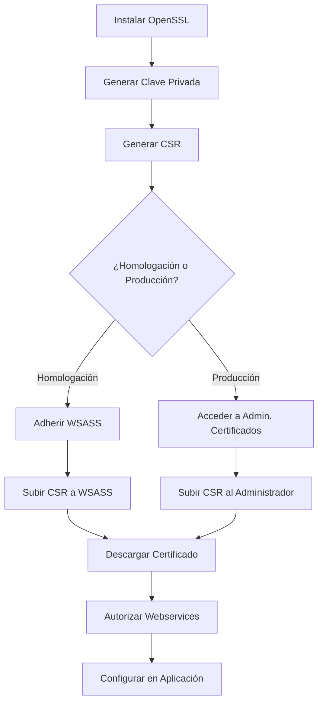

# Guía de Generación de Certificados ARCA (AFIP)

Esta guía detalla el proceso completo para generar certificados digitales para los webservices de ARCA/AFIP, tanto para el ambiente de **homologación** (testing) como para **producción**.

---

## Tabla de Contenidos

1. [Requisitos Previos](#requisitos-previos)
2. [Diferencias entre Homologación y Producción](#diferencias-entre-homologación-y-producción)
3. [Generación de Clave Privada y CSR](#generación-de-clave-privada-y-csr)
4. [Certificado de Homologación](#certificado-de-homologación)
5. [Certificado de Producción](#certificado-de-producción)
6. [Autorización de Webservices](#autorización-de-webservices)
7. [Renovación de Certificados](#renovación-de-certificados)
8. [Estructura de Archivos](#estructura-de-archivos)

---

## Requisitos Previos

Antes de comenzar, asegurate de contar con:

| Requisito | Descripción |
|-----------|-------------|
| **Clave Fiscal** | Nivel 3 o superior habilitada en AFIP |
| **OpenSSL** | Instalado en tu sistema operativo |
| **CUIT** | El CUIT del contribuyente (sin guiones) |
| **Acceso a Internet** | Para acceder al portal de AFIP |

### Instalación de OpenSSL

**Windows:**
```powershell
# Descargar desde https://slproweb.com/products/Win32OpenSSL.html
# O instalar via chocolatey:
choco install openssl
```

**Linux/Mac:**
```bash
# Generalmente viene preinstalado
# Verificar con:
openssl version
```

---

## Diferencias entre Homologación y Producción

> [!IMPORTANT]
> Los certificados de homologación **NO** tienen validez para producción. Son exclusivamente para pruebas.

| Aspecto | Homologación | Producción |
|---------|--------------|------------|
| **Propósito** | Testing y desarrollo | Operaciones reales y legales |
| **Portal de Gestión** | WSASS - Autogestión Certificados Homologación | Administrador de Certificados Digitales |
| **Validez Legal** | No tiene | Sí tiene |
| **Endpoints AFIP** | URLs de testing | URLs de producción |
| **Datos generados** | Ficticios/de prueba | Datos fiscales reales |

---

## Generación de Clave Privada y CSR

Este paso es **común** para ambos ambientes y se realiza en tu sistema local.

### Paso 1: Crear directorio de trabajo

```powershell
# Crear carpeta para los certificados
mkdir certs
cd certs
```

### Paso 2: Generar la Clave Privada

```bash
openssl genrsa -out privada.key 2048
```

> [!CAUTION]
> **Guardá esta clave privada en un lugar seguro.** Sin ella, el certificado será inútil. Hacé una copia de respaldo.

### Paso 3: Generar la Solicitud de Certificado (CSR)

```bash
openssl req -new -key privada.key -out pedidoCertificado.csr -subj "/C=AR/O=TU_EMPRESA/CN=TU_NOMBRE/serialNumber=CUIT XXXXXXXXXX"
```

**Ejemplo real:**
```bash
openssl req -new -key privada.key -out pedidoCertificado.csr -subj "/C=AR/O=MiEmpresaSRL/CN=Juan Perez/serialNumber=CUIT 20123456789"
```

> [!WARNING]
> - **No uses caracteres especiales** (ñ, tildes, etc.) en los valores
> - El CUIT debe ir **sin guiones**
> - El `serialNumber` debe incluir la palabra "CUIT" antes del número

### Verificar el CSR generado

```bash
openssl req -text -noout -verify -in pedidoCertificado.csr
```

---

## Certificado de Homologación

El certificado de homologación se utiliza para **pruebas de desarrollo** antes de pasar a producción.

### Paso 1: Adherir el servicio WSASS

1. Ingresá a [https://www.afip.gob.ar](https://www.afip.gob.ar)
2. Accedé con tu **CUIT** y **Clave Fiscal**
3. Buscá **"Administrador de Relaciones de Clave Fiscal"**
4. Seleccioná **"Adherir servicio"**
5. Buscá y seleccioná **"WSASS - Autogestión Certificados Homologación"**
6. Confirmá la adhesión

### Paso 2: Acceder a WSASS

1. Desde el menú principal de AFIP, buscá **"WSASS - Autogestión Certificados Homologación"**
2. Ingresá al servicio

### Paso 3: Crear nuevo certificado

1. Seleccioná **"Nuevo Certificado"** o **"Agregar Certificado"**
2. Ingresá un **alias** descriptivo (ej: `cert_homologacion_facturacion`)
3. Subí el archivo `pedidoCertificado.csr` generado anteriormente
4. Confirmá la operación
5. **Descargá el certificado** generado (archivo `.crt` o `.pem`)

### Paso 4: Autorizar webservices en homologación

1. Dentro de WSASS, buscá **"Autorizar webservices"** o **"Crear autorización a servicio"**
2. Seleccioná el certificado que acabás de crear
3. Elegí el **CUIT representado** (puede ser el tuyo propio)
4. Seleccioná los webservices a autorizar:
   - `wsfe` - Facturación Electrónica
   - `wsfev1` - Facturación Electrónica v1
   - `wsfex` - Facturación de Exportación
   - `wscdc` - Constatación de Comprobantes
   - Otros según necesidad
5. Confirmá cada autorización

---

## Certificado de Producción

El certificado de producción se utiliza para **operaciones reales** con validez fiscal.

### Paso 1: Acceder al Administrador de Certificados

1. Ingresá a [https://www.afip.gob.ar](https://www.afip.gob.ar)
2. Accedé con tu **CUIT** y **Clave Fiscal**
3. Buscá **"Administrador de Certificados Digitales"**
4. Ingresá al servicio

### Paso 2: Crear nuevo certificado

1. Seleccioná **"Agregar Alias"** o **"Nuevo Certificado"**
2. Ingresá un **alias** descriptivo (ej: `cert_produccion_facturacion`)
3. Seleccioná **"Elegir archivo"** y subí el `pedidoCertificado.csr`
4. Confirmá la operación
5. **Descargá el certificado** generado (archivo `.crt`)

> [!NOTE]
> Si vas a usar el mismo CSR para homologación y producción, cada uno generará un certificado diferente. Podés tener ambos activos simultáneamente.

### Paso 3: Autorizar webservices en producción

1. Ingresá al **"Administrador de Relaciones de Clave Fiscal"**
2. Seleccioná **"Agregar relación"** o **"Nueva Relación"**
3. Buscá **"AFIP"** como servicio
4. Seleccioná **"Webservices"**
5. Elegí el webservice específico:
   - **ws_sr_padron_a13** - Padrón A13
   - **wsfe** - Facturación Electrónica
   - **wsfev1** - Facturación Electrónica v1
   - Otros según necesidad
6. Seleccioná tu **certificado de producción**
7. Confirmá la relación

---

## Autorización de Webservices

### Webservices más comunes

| Servicio | Descripción | Uso |
|----------|-------------|-----|
| `wsfe` / `wsfev1` | Facturación Electrónica | Emisión de facturas A, B, C |
| `wsfex` | Facturación de Exportación | Facturas tipo E |
| `wscdc` | Constatación de Comprobantes | Verificar comprobantes de terceros |
| `ws_sr_padron_a13` | Padrón A13 | Consultar condición fiscal de contribuyentes |
| `ws_sr_constancia_inscripcion` | Constancia de Inscripción | Obtener constancia de inscripción |

### URLs de los Webservices

**Homologación (Testing):**
```
WSAA: https://wsaahomo.afip.gov.ar/ws/services/LoginCms
WSFE: https://wswhomo.afip.gov.ar/wsfev1/service.asmx
```

**Producción:**
```
WSAA: https://wsaa.afip.gov.ar/ws/services/LoginCms
WSFE: https://servicios1.afip.gov.ar/wsfev1/service.asmx
```

---

## Renovación de Certificados

> [!WARNING]
> Los certificados de AFIP tienen una vigencia limitada (generalmente 2 años). Debés renovarlos **antes** de que venzan.

### Proceso de renovación

1. **Verificar fecha de vencimiento** del certificado actual
2. **Generar nuevo CSR** (podés reutilizar la misma clave privada o generar una nueva)
3. **Subir el nuevo CSR** al portal correspondiente (WSASS o Administrador de Certificados)
4. **Descargar el nuevo certificado**
5. **Actualizar la configuración** de tu aplicación con el nuevo certificado
6. **Re-autorizar los webservices** si es necesario

### Verificar vencimiento del certificado

```bash
openssl x509 -enddate -noout -in certificado.crt
```

---

## Estructura de Archivos

Una vez completado el proceso, deberías tener la siguiente estructura:

```
certs/
├── privada.key              # Clave privada (NUNCA compartir)
├── pedidoCertificado.csr    # Solicitud de certificado
├── homologacion.crt         # Certificado de homologación
└── produccion.crt           # Certificado de producción
```

### Ubicación recomendada en el proyecto

```
sistema-gestion/
└── apps/
    └── backend/
        └── certs/
            ├── homologacion/
            │   ├── privada.key
            │   └── certificado.crt
            └── produccion/
                ├── privada.key
                └── certificado.crt
```

> [!CAUTION]
> **Nunca subas las claves privadas ni certificados a un repositorio público.** 
> Agregá la carpeta `certs/` al `.gitignore`.

---

## Resumen del Proceso



---

## Troubleshooting

### Error: "El CSR no es válido"
- Verificá que el CSR no tenga caracteres especiales
- Asegurate de que el CUIT esté sin guiones
- Regenerá el CSR si es necesario

### Error: "Certificado no autorizado para el servicio"
- Revisá que el certificado esté correctamente asociado al webservice
- Verificá que la autorización esté activa en el Administrador de Relaciones

### Error: "Certificado vencido"
- Seguí el proceso de renovación detallado arriba
- Los certificados tienen vigencia limitada (generalmente 2 años)

---

## Referencias

- [Portal AFIP](https://www.afip.gob.ar)
- [Documentación WSASS](https://www.afip.gob.ar/ws/documentacion/wsass.asp)
- [Manual de Webservices AFIP](https://www.afip.gob.ar/ws/)
- [AFIP SDK - Documentación](https://afipsdk.com/)

---

*Última actualización: Diciembre 2024*
